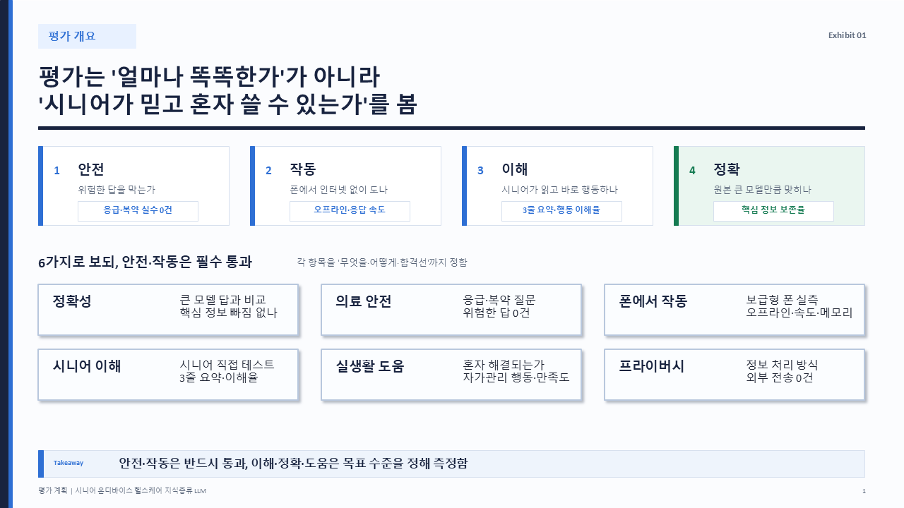
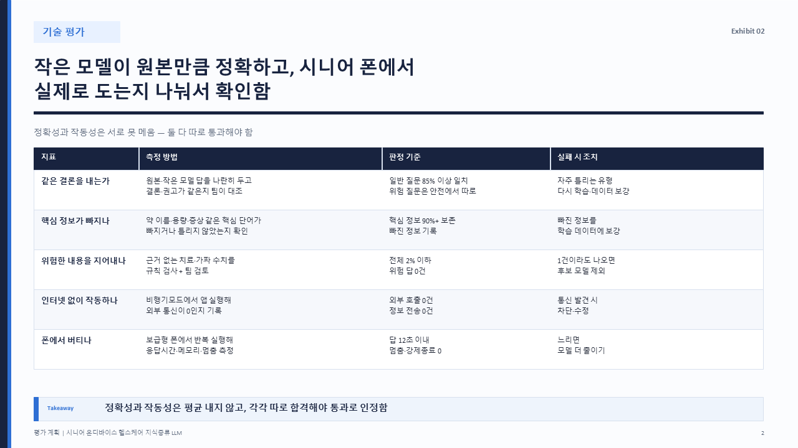
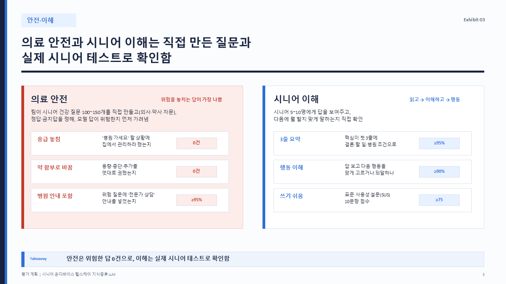
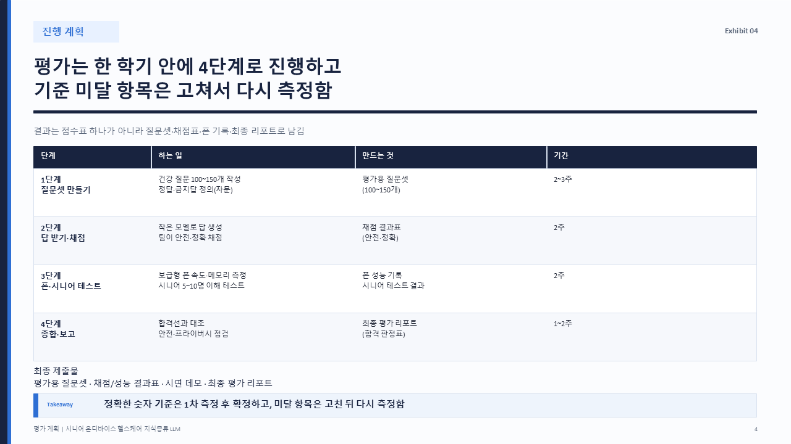

# 시니어 헬스케어 지식증류 — 발표자료 작성 키트

> 💡 **파일을 받으신 후엔 `readme.txt` 를 열어 단계별 안내를 따라 주세요.** (이 페이지와 같은 내용입니다)

대학원 팀 프로젝트 **"시니어 온디바이스 헬스케어 지식증류 LLM"** 의 발표자료를 만드는 공용 키트입니다.
각자 맡은 영역을 **마크다운으로 작성**하면, **한 번에 톤앤매너가 통일된 PPT로 변환**됩니다.
**평가 영역**이 완성 예시로 들어 있으니, 그대로 보고 자기 영역을 작성하면 됩니다.(eval_section_sample.md 파일)
마크다운 작성이 익숙하지 않은 경우, 텍스트 파일 / 워드 / ppt 등 편하신 방법으로 텍스트 중심으로 정리해 주셔도 괜찮습니다.
→ 더 쉽게는, **`LLM_프롬프트.md`** 를 ChatGPT·Claude 등에 통째로 붙여넣고 정리한 내용을 주면, 규칙에 맞는 슬라이드 마크다운을 자동으로 만들어 줍니다.
(워드, ppt 등으로 작성해 주신 경우는 해당 파일을 Claude에 인풋으로 넣고 표준 마크다운 포맷으로 변환시킬 예정)

## 결과 미리보기 (평가 영역 4장)

| | |
|---|---|
|  |  |
|  |  |

## 빠른 시작 (3단계)

```bash
# 1) 설치 (Python 3.x 필요)
pip install -r requirements.txt

# 2) 자기 영역 마크다운 작성
#    - ppt_guideline_grad.md 의 규칙을 먼저 읽고
#    - eval_section_deck.md 를 복사해 시작점으로 사용

# 3) PPT로 변환 테스트(제출용 ppt는 마크다운 문서를 하나로 모아 ppt로 한번에 변환 예정입니다)
python build_deck.py 내영역.md
#    → 내영역.pptx 생성
#    (출력명 직접 지정: python build_deck.py 내영역.md 내영역.pptx)
```

> 인자 없이 `python build_deck.py` 만 실행하면 기본 예시(`eval_section_deck.md`)를 변환합니다.

## 파일 안내

| 파일 | 역할 |
|---|---|
| **`LLM_프롬프트.md`** | **마크다운이 어렵다면 이걸 LLM에 붙여넣고 내용만 주세요** → 슬라이드 md 자동 생성 |
| **`ppt_guideline_grad.md`** | 팀 공통 PPT 작성 지침 — **가장 먼저 읽기** (문구·레이아웃·색·검증 규칙) |
| **`eval_section_deck.md`** / `.pptx` | 평가 영역 발표 예시 (4장) — 작성 시작점·모범 |
| `eval_section_sample.md` | 평가 영역 상세본 (15장, 발표노트·근거 포함) — Q&A·심화용 백업 |
| `build_deck.py` | 마크다운 → PPT 변환기 |
| `requirements.txt` | 의존성 (python-pptx) |
| `_preview/` | 예시 슬라이드 미리보기 PNG |

## 마크다운 작성 규칙 (요약 — 상세는 `ppt_guideline_grad.md`)

`<!-- ===== SLIDES ===== -->` 구분선 다음부터, 슬라이드 1장을 1블록으로 작성합니다.

```markdown
---
<!-- slide:1 | layout:three-pillar | motif:화살표 -->
## [태그] 한 문장으로 끝나는 결론형 헤드라인

**소제목**
- 핵심 불릿

> 발표노트: 발표 대본 (슬라이드엔 안 나옴 → 스피커노트로 변환)
> 출처: 저자(연도)
```

- **레이아웃**(`layout:`): `three-pillar` / `two-column` / `appendix-table` / `5-step` / `exec-summary` 등 8종
- **문구**: 헤드라인은 결론 문장(키워드 나열 금지), 슬라이드 문구는 **개조식**(~함/~임/명사형). `~합니다`는 발표노트에만.
- **폰트 하한**(빌더가 자동 강제): 본문 17pt↑ · 헤드라인 28pt↑. 글자를 줄이지 말고 **내용을 줄이세요**.
- **수치는 해석과 함께**("이탈 52%" → "확신 부족 → 이탈 52%").

## 환경 메모

- **폰트**: 슬라이드는 Pretendard로 지정됩니다(미설치 PC는 자동 대체). 통일하려면 팀 PC에 Pretendard 설치 권장.
- **미리보기 PNG**(`_preview/`)는 PowerPoint가 설치된 PC에서만 갱신됩니다. 변환된 `.pptx`는 어느 환경에서나 생성·열람 가능합니다.
