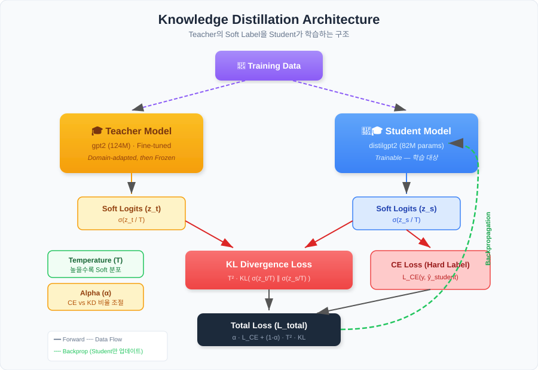
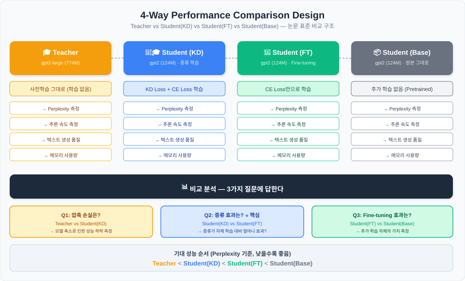
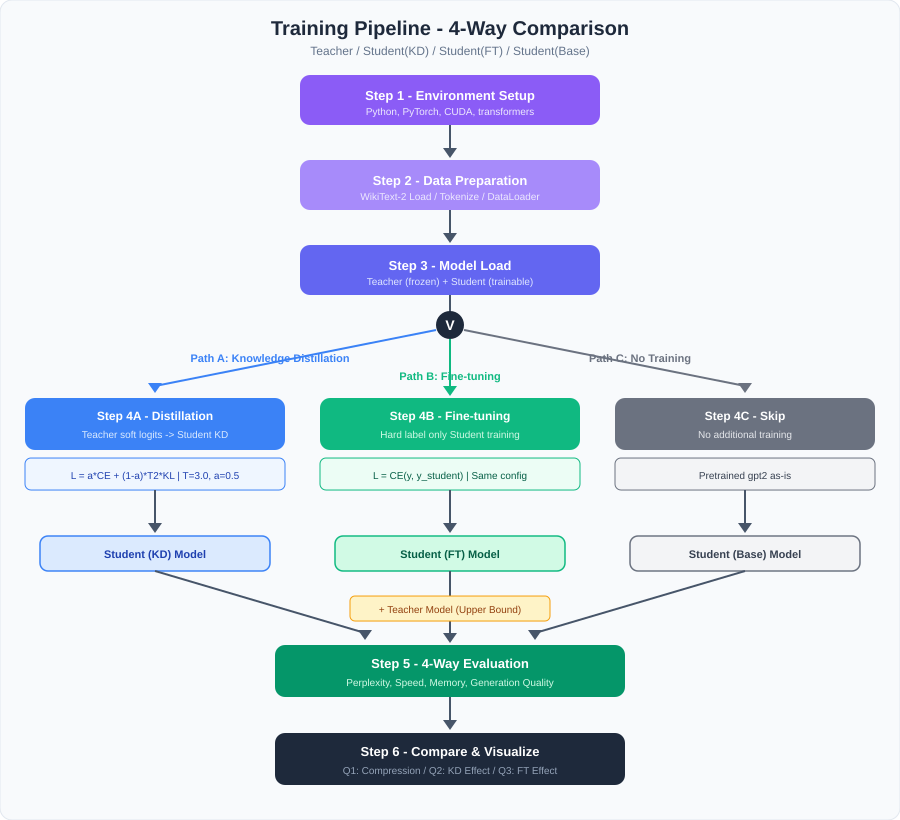

# LLM 지식 증류 (Knowledge Distillation) 프로젝트

> 대형 언어 모델(Teacher)의 지식을 소형 모델(Student)로 전이하는 지식 증류를 구현하고,  
> **4가지 모델의 성능을 비교·분석**하는 실험 프로젝트

---

## 목차

1. [프로젝트 개요](#1-프로젝트-개요)
2. [배경 지식: 지식 증류란?](#2-배경-지식-지식-증류란)
3. [프로젝트 목표](#3-프로젝트-목표)
4. [모델 구성](#4-모델-구성)
5. [실험 설계](#5-실험-설계)
6. [핵심 알고리즘 상세](#6-핵심-알고리즘-상세)
7. [하이퍼파라미터](#7-하이퍼파라미터)
8. [프로젝트 구조](#8-프로젝트-구조)
9. [환경 요구사항](#9-환경-요구사항)
10. [빠른 시작 (Quick Start)](#10-빠른-시작-quick-start)
11. [진행 일정](#11-진행-일정)
12. [참고 문서](#12-참고-문서)
13. [참고 자료 & 레퍼런스](#13-참고-자료--레퍼런스)

---

## 1. 프로젝트 개요

### 한 줄 요약

**큰 LLM(Teacher)이 아는 것을 작은 LLM(Student)에게 가르쳐서, 작은 모델이 혼자 공부한 것보다 더 잘하게 만든다.**

### 왜 지식 증류인가?

| 문제 | 해결 |
|------|------|
| 대형 모델은 성능은 좋지만 추론 비용이 높다 | 작은 모델로 성능을 근사하여 비용 절감 |
| 소형 모델은 혼자 학습하면 한계가 있다 | Teacher의 "지식"을 전달받아 성능 향상 |
| 엣지 디바이스에 대형 모델을 배포할 수 없다 | 증류된 소형 모델로 배포 가능 |
| 모델 서빙 비용을 줄이고 싶다 | 동일 하드웨어에서 더 많은 요청 처리 |

### 이 프로젝트에서 하는 것

1. **지식 증류 파이프라인 구현** — Python + PyTorch + Hugging Face
2. **4가지 모델 학습/평가** — Teacher / Student(KD) / Student(FT) / Student(Base)
3. **성능 비교 실험** — Perplexity, 추론 속도, 메모리, 생성 품질
4. **결과 시각화** — 차트 및 비교 리포트 생성

---

## 2. 배경 지식: 지식 증류란?

### 핵심 아이디어

일반적인 모델 학습에서는 **정답(hard label)**만 보고 학습합니다:
- 정답: `[0, 0, 1, 0, 0]` (정답 클래스만 1)

지식 증류에서는 Teacher 모델이 출력하는 **확률 분포(soft label)**까지 학습합니다:
- Teacher 출력: `[0.05, 0.15, 0.60, 0.12, 0.08]` (클래스 간 관계 정보 포함)

이 soft label에는 **"클래스 간의 유사도"** 정보가 담겨 있어, Student가 더 풍부한 지식을 학습할 수 있습니다.

> 📄 개념 출처: **Hinton et al. (2015)** — [상세 논문 정리](docs/papers.md#11--distilling-the-knowledge-in-a-neural-network)

### Temperature의 역할

Temperature(T)를 높이면 확률 분포가 더 **부드러워집니다**:

| Temperature | 분포 형태 | 효과 |
|------------|----------|------|
| T = 1 (기본) | 뾰족함 (peaked) | 정답에 집중, 클래스 간 관계 정보 적음 |
| T = 3 | 부드러움 (soft) | 클래스 간 관계 정보가 풍부해짐 |
| T = 10 | 매우 평탄 (flat) | 거의 균일 분포, 정보 손실 |

→ 보통 **T = 2~5** 범위가 효과적

### KD Loss 아키텍처

아래 다이어그램은 Knowledge Distillation의 전체 아키텍처를 보여줍니다.  
동일한 입력이 Teacher와 Student에 각각 전달되며, Teacher의 soft label과 Student의 출력 사이의 **KL Divergence**, 그리고 정답 label과의 **Cross-Entropy**를 가중 합산하여 최종 KD Loss를 계산합니다.



- **왼쪽 경로**: Teacher 모델이 Temperature T로 softmax를 거쳐 soft label 생성 (학습 중 가중치 고정)
- **오른쪽 경로**: Student 모델이 동일한 Temperature T로 soft prediction 생성
- **Loss 합산**: `KD Loss = α · CE(Student, Label) + (1-α) · T² · KL(Student ∥ Teacher)`

---

## 3. 프로젝트 목표

### 주요 목표 (Must Have)

| # | 목표 | 설명 | 산출물 |
|---|------|------|--------|
| G1 | 지식 증류 파이프라인 | Teacher → Student KD 학습 코드 | `distill.py` |
| G2 | 베이스라인 Fine-tuning | Student 자체 Fine-tuning 코드 | `train_baseline.py` |
| G3 | **4-Way 성능 비교** | Teacher / KD / FT / Base 비교 | `compare.py` |
| G4 | 결과 시각화 | Perplexity, 속도, 메모리 차트 | `results/figures/` |

### 부가 목표 (Nice to Have)

| # | 목표 | 설명 |
|---|------|------|
| G5 | Temperature 민감도 분석 | T 값에 따른 성능 변화 실험 |
| G6 | Alpha 비율 분석 | α 값에 따른 성능 변화 실험 |
| G7 | Forward KL vs Reverse KL 비교 | MiniLLM(2024) 논문 접근법 재현 |
| G8 | 다른 모델 조합 실험 | Tier 2 (LLaMA/Mistral) 조합 |

---

## 4. 모델 구성

### 설치 방식: 로컬 설치형

이 프로젝트의 LLM은 **로컬 설치형**입니다:

- ☁️ ~~클라우드 API 호출~~ → ✅ **로컬 GPU에서 직접 실행**
- Hugging Face Hub에서 모델 가중치를 다운로드하여 로컬 디스크에 저장
- 최초 1회 다운로드 후 **오프라인에서도 실행 가능**
- API 비용 없음, 데이터가 외부로 나가지 않음

> 📖 상세: [모델 설치 가이드](docs/model-installation-guide.md)

### 기본 모델 조합

본 프로젝트의 **기본 선택**:

| 역할 | 모델 | 파라미터 | VRAM (FP16) | 선택 이유 |
|------|------|---------|-------------|----------|
| **Teacher** | `gpt2-large` | 774M | ~1.5GB | 충분한 크기차, 무제한 다운로드, 일반 GPU OK |
| **Student** | `gpt2` (small) | 124M | ~0.25GB | 동일 토크나이저, 6.2x 크기비, 빠른 학습 |

> 📖 모델 선택 기준, 호환성, GPU별 추천 → [모델 선택 가이드](docs/model-selection-guide.md)  
> 📖 다운로드, 인증, 양자화, 캐시 관리 → [모델 설치 가이드](docs/model-installation-guide.md)

---

## 5. 실험 설계

### 5.1 4-Way 비교 구조

> 📄 비교 방식 출처: DistilBERT (2019), Zephyr (2023), MiniLLM (2024) — [논문 상세](docs/papers.md)



**4가지 모델**을 비교하여 증류 효과를 정밀하게 측정합니다:

| # | 모델 | 아키텍처 | 학습 방식 | 역할 |
|---|------|---------|----------|------|
| 1 | **Teacher** | `gpt2-large` (774M) | 사전학습 그대로 | Upper Bound |
| 2 | **Student (KD)** | `gpt2` (124M) | KD Loss + CE Loss | 증류 효과 검증 |
| 3 | **Student (FT)** | `gpt2` (124M) | CE Loss만 Fine-tuning | Fine-tuning 기준선 |
| 4 | **Student (Base)** | `gpt2` (124M) | 추가 학습 없음 (원본) | Lower Bound |

### 왜 3-Way가 아니라 4-Way인가?

기존 3-Way(Teacher / KD / Base)에서는 하나의 질문밖에 답할 수 없습니다:
- "증류가 잘 되었나?" (Teacher vs KD)

4-Way로 하면 **3가지 핵심 질문**에 모두 답할 수 있습니다:

| 비교 | 질문 | 의미 |
|------|------|------|
| **Q1**: Teacher vs Student(KD) | 압축 손실은 얼마? | 모델 크기를 줄인 대가 측정 |
| **Q2**: Student(KD) vs Student(FT) | **증류의 순수 효과는?** ⭐ | KD가 자체 학습 대비 얼마나 더 효과적인가 (핵심!) |
| **Q3**: Student(FT) vs Student(Base) | Fine-tuning 자체의 가치는? | 추가 학습이 원본 대비 얼마나 향상 시키는가 |

> 📄 이 4-Way 구조는 DistilBERT, TinyBERT, MiniLLM, Zephyr 등 주요 논문에서 표준으로 사용됩니다.  
> — [논문별 차용 내역](docs/papers.md#5-논문--프로젝트-매핑)

### 5.2 공정 비교를 위한 통제 변인

Student(KD)와 Student(FT)는 **Loss 함수를 제외하고 모든 조건이 동일**해야 합니다:

| 변인 | Student(KD) | Student(FT) | Student(Base) | 동일 여부 |
|------|-------------|-------------|---------------|----------|
| 기본 모델 | gpt2 (124M) | gpt2 (124M) | gpt2 (124M) | ✅ 동일 |
| 학습 데이터 | WikiText-2 | WikiText-2 | - | ✅ 동일 (Base 제외) |
| Epochs | 3~5 | 3~5 | - | ✅ 동일 |
| Learning Rate | 5e-5 | 5e-5 | - | ✅ 동일 |
| Batch Size | 8 | 8 | - | ✅ 동일 |
| Max Seq Length | 512 | 512 | - | ✅ 동일 |
| Optimizer | AdamW | AdamW | - | ✅ 동일 |
| **Loss 함수** | **KD + CE** | **CE만** | - | ❌ **유일한 차이** |

### 5.3 학습 파이프라인

아래 다이어그램은 프로젝트의 전체 학습 파이프라인을 단계별로 보여줍니다.  
데이터 준비부터 4-Way 모델 학습, 평가, 결과 비교까지의 흐름을 한눈에 확인할 수 있습니다.



**파이프라인 주요 단계:**
1. **데이터 준비** — WikiText-2 로드 및 토크나이징
2. **Teacher 추론** — Teacher 모델로 soft label 생성 (가중치 고정)
3. **Student(KD) 학습** — KD Loss(CE + KL)로 증류 학습
4. **Student(FT) 학습** — CE Loss만으로 Fine-tuning (대조군)
5. **평가 & 비교** — 4-Way(Teacher / KD / FT / Base) 성능 비교 및 시각화

### 5.4 평가 지표

| 지표 | 측정 방법 | 의미 | 기대 순위 |
|------|----------|------|----------|
| **Perplexity** | exp(avg CE loss) | 언어 모델링 품질 (↓) | Teacher < KD < FT < Base |
| **Train Loss 수렴** | 학습 중 loss 기록 | 학습 안정성, 수렴 속도 | KD가 FT보다 빨리 수렴 |
| **추론 속도** | tokens/sec | 실시간 서빙 성능 | Student 3개 동일 >> Teacher |
| **추론 지연시간** | ms/token | 응답 속도 | Student << Teacher |
| **메모리 사용량** | peak VRAM (GB) | 배포 하드웨어 요구 | Student << Teacher |
| **모델 크기** | 파라미터 수, 디스크 | 저장/전송 비용 | Student << Teacher |
| **텍스트 생성 품질** | 정성 비교 | 실제 출력 품질 | Teacher > KD > FT > Base |

### 5.5 데이터셋

| 데이터셋 | 용도 | 크기 | 특징 |
|----------|------|------|------|
| **`wikitext-2`** (기본) | 학습 + 평가 | ~2MB | 가볍고 빠른 실험, LM 벤치마크 표준 |
| `wikitext-103` (옵션) | 대규모 실험 | ~500MB | 더 충분한 학습 데이터 |

> 📄 데이터셋 선택 근거: MiniLLM (2024), DistiLLM (2024) 논문과 동일 벤치마크 사용

---

## 6. 핵심 알고리즘 상세

### 6.1 KD Loss 수식

> 📄 출처: Hinton et al. (2015) — [논문 상세](docs/papers.md#11--distilling-the-knowledge-in-a-neural-network)

```
L_total = α · L_CE(y, ŷ_student) + (1 - α) · T² · KL(σ(z_t/T) ∥ σ(z_s/T))
```

각 항의 의미:

| 항 | 수식 | 역할 | 출처 |
|----|------|------|------|
| **Hard Label Loss** | `L_CE(y, ŷ_student)` | 정답 레이블로부터 학습 | 표준 CE |
| **KD Loss** | `T² · KL(σ(z_t/T) ∥ σ(z_s/T))` | Teacher soft label 모방 | Hinton (2015) |
| **α (alpha)** | 스칼라 가중치 | 두 loss의 비율 조절 | Hinton (2015) |
| **T (temperature)** | 스칼라 온도 | soft label 부드러움 조절 | Hinton (2015) |
| **T²** | Temperature 보정 | Temperature gradient 보정 | Hinton (2015) |

### 6.2 Forward KL vs Reverse KL

> 📄 출처: MiniLLM (2024), GKD (2023) — [논문 상세](docs/papers.md#22--minillm-knowledge-distillation-of-large-language-models)

| 방식 | 수식 | 특성 | 이 프로젝트에서 |
|------|------|------|---------------|
| **Forward KL** | `KL(P_teacher ∥ P_student)` | Mean-seeking: Student가 Teacher 전체 분포를 커버 | ✅ 기본 구현 |
| **Reverse KL** | `KL(P_student ∥ P_teacher)` | Mode-seeking: Student가 Teacher의 핵심 모드에 집중 | 📌 확장 과제 |

MiniLLM 논문에서는 LLM 증류 시 Reverse KL이 더 효과적일 수 있음을 보였으나, 본 프로젝트는 표준 Forward KL로 시작합니다.

### 6.3 수도코드 (Pseudocode)

```python
for batch in dataloader:
    input_ids, labels = batch

    # 1. Teacher forward (no gradient)
    with torch.no_grad():
        teacher_logits = teacher_model(input_ids).logits

    # 2. Student forward
    student_logits = student_model(input_ids).logits

    # 3. Soft label 생성 (Temperature 적용)
    teacher_soft = softmax(teacher_logits / T, dim=-1)
    student_soft = log_softmax(student_logits / T, dim=-1)

    # 4. KD Loss (KL Divergence)
    kd_loss = T * T * KL_divergence(student_soft, teacher_soft)

    # 5. Hard Label Loss (Cross-Entropy)
    ce_loss = cross_entropy(student_logits, labels)

    # 6. Total Loss
    total_loss = alpha * ce_loss + (1 - alpha) * kd_loss

    # 7. Backpropagation (Student만 업데이트)
    total_loss.backward()
    optimizer.step()
```

---

## 7. 하이퍼파라미터

### 기본값

| 파라미터 | 값 | 범위 | 설명 |
|---------|-----|------|------|
| `temperature` | 3.0 | 1.0 ~ 10.0 | Soft label 온도 |
| `alpha` | 0.5 | 0.0 ~ 1.0 | CE vs KD 비율 |
| `learning_rate` | 5e-5 | 1e-5 ~ 1e-4 | Student 학습률 |
| `batch_size` | 8 | 4 ~ 32 | GPU 메모리에 따라 조정 |
| `max_seq_length` | 512 | 128 ~ 1024 | 입력 토큰 최대 길이 |
| `epochs` | 3 | 3 ~ 10 | 전체 데이터 반복 횟수 |
| `warmup_steps` | 100 | 50 ~ 500 | Learning rate warmup |
| `weight_decay` | 0.01 | 0.0 ~ 0.1 | AdamW 가중치 감쇄 |
| `gradient_clip` | 1.0 | 0.5 ~ 2.0 | Gradient clipping |

### 하이퍼파라미터 튜닝 가이드

| 상황 | 조정 방법 |
|------|----------|
| Loss가 발산한다 | `learning_rate` ↓, `gradient_clip` 추가 |
| KD와 FT 차이가 없다 | `temperature` ↑ (3→5), `alpha` ↓ (0.5→0.3) |
| GPU OOM 발생 | `batch_size` ↓, `max_seq_length` ↓ |
| 과적합(overfitting) | `epochs` ↓, `weight_decay` ↑ |

---

## 8. 프로젝트 구조

```
knowledge-distillation/
│
├── README.md                        # 이 문서 (프로젝트 전체 설명)
├── requirements.txt                 # Python 의존성 목록
│
├── docs/                            # 📖 문서
│   ├── papers.md                    #   📄 논문 레퍼런스 & 개념 출처 매핑
│   ├── model-selection-guide.md     #   모델 선택 가이드 (비교표, GPU별 추천)
│   ├── model-installation-guide.md  #   모델 설치 가이드 (다운로드, 인증, 양자화)
│   ├── schedule.md                  #   상세 진행 일정 (Phase별 체크리스트)
│   ├── research-direction-guide.md  #   연구 방향 가이드 (모델/데이터 경로)
│   ├── glossary.md                  #   용어집 (팀원 배경지식 보완)
│   └── diagrams/                    #   📊 다이어그램 (SVG)
│       ├── kd-architecture.svg      #     지식 증류 전체 아키텍처
│       ├── 4way-comparison.svg      #     4-Way 비교 실험 구조
│       ├── training-pipeline.svg    #     학습 파이프라인 흐름도
│       └── local-install-flow.svg   #     로컬 설치 흐름도
│
├── config.py                        # ⚙️ 하이퍼파라미터 & 경로 설정
├── dataset.py                       # 📄 데이터 로드 & 전처리
├── models.py                        # 🤖 Teacher/Student 모델 로드
│
├── distill.py                       # 🔥 지식 증류 학습 (핵심)
├── train_baseline.py                # 📝 Student 자체 Fine-tuning
├── evaluate.py                      # 📏 개별 모델 평가
├── compare.py                       # 🆚 4-Way 비교 & 시각화
│
├── verify_setup.py                  # ✅ 환경 검증 스크립트
│
├── examples/                        # 📚 참고 예제 (CIFAR-10 CNN 기반 KD)
│   ├── README.md                    #   예제 설명
│   ├── cifar10_knowledge_...ipynb   #   CIFAR-10 KD 실습 노트북
│   ├── main.py                      #   예제 실행 스크립트
│   └── pyproject.toml               #   예제 의존성
│
└── results/                         # 📁 실험 결과
    ├── figures/                     #   시각화 차트 (PNG)
    ├── logs/                        #   학습 로그
    └── checkpoints/                 #   모델 체크포인트
```

### 파일별 역할

| 파일 | 실행 순서 | 입력 | 출력 |
|------|----------|------|------|
| `verify_setup.py` | 0 (선행) | - | 환경 정상 여부 |
| `config.py` | - (설정) | - | 하이퍼파라미터 |
| `dataset.py` | 1 | 데이터셋 이름 | DataLoader |
| `models.py` | 2 | 모델 이름 | Teacher/Student 모델 |
| `distill.py` | 3a | DataLoader + 모델 | Student(KD) 체크포인트 |
| `train_baseline.py` | 3b | DataLoader + Student | Student(FT) 체크포인트 |
| `evaluate.py` | 4 | 모델 체크포인트 | Perplexity, 속도 등 |
| `compare.py` | 5 | 4개 모델 평가 결과 | 비교 차트 + 리포트 |

---

## 9. 환경 요구사항

### 하드웨어

| 항목 | 최소 | 권장 |
|------|------|------|
| **GPU** | RTX 3060 (12GB) | RTX 3090/4090 (24GB) |
| **RAM** | 16GB | 32GB |
| **디스크** | 10GB 여유 | 20GB+ |

### 소프트웨어

| 항목 | 버전 | 확인 명령 |
|------|------|----------|
| Python | 3.10+ | `python --version` |
| PyTorch | 2.0+ | `python -c "import torch; print(torch.__version__)"` |
| CUDA | 11.8+ | `nvidia-smi` |
| transformers | 4.35+ | `python -c "import transformers; print(transformers.__version__)"` |

---

## 10. 빠른 시작 (Quick Start)

```bash
# 1. 프로젝트 폴더 진입
cd knowledge-distillation

# 2. 가상환경 생성 & 활성화
python -m venv venv
source venv/bin/activate

# 3. 의존성 설치
pip install -r requirements.txt

# 4. 환경 검증
python verify_setup.py

# 5. 지식 증류 학습  (→ Student-KD 생성)
python distill.py

# 6. 베이스라인 학습   (→ Student-FT 생성)
python train_baseline.py

# 7. 4-Way 평가 & 비교 (Teacher + KD + FT + Base)
python evaluate.py
python compare.py
```

> ⚠️ 5~7번 코드는 아직 구현 전입니다. Phase 2~4에서 순차 구현 예정.

---

## 11. 진행 일정

### 개요

| Phase | 내용 | 상태 |
|-------|------|------|
| **Phase 1** | 프로젝트 준비 (문서, 환경, GPU 확인) | 🔄 진행 중 |
| **Phase 2** | 핵심 모듈 구현 (config, data, model) | ⬜ 대기 |
| **Phase 3** | 학습 구현 및 실행 (distill, baseline) | ⬜ 대기 |
| **Phase 4** | 평가 및 결과 분석 (4-Way 비교) | ⬜ 대기 |

### 마일스톤

| 마일스톤 | 완료 조건 | 상태 |
|---------|----------|------|
| **M1** | 환경 준비 완료, verify_setup.py 통과 | ⬜ |
| **M2** | DataLoader에서 정상 배치 출력 확인 | ⬜ |
| **M3** | distill.py 1 epoch 완주, loss 감소 확인 | ⬜ |
| **M4** | 증류 학습 + FT 학습 모두 완료 | ⬜ |
| **M5** | 4-Way 비교 차트 및 리포트 생성 | ⬜ |

> 📖 Phase별 세부 작업 체크리스트 → [상세 진행 일정](docs/schedule.md)

---

## 12. 참고 문서

| 문서 | 경로 | 설명 |
|------|------|------|
| **논문 레퍼런스** | [docs/papers.md](docs/papers.md) | 참고 논문, 개념 출처 매핑, 읽기 순서 추천 |
| **용어집** | [docs/glossary.md](docs/glossary.md) | 프로젝트 핵심 용어 정리 (배경지식 보완) |
| **연구 방향 가이드** | [docs/research-direction-guide.md](docs/research-direction-guide.md) | 모델/데이터 선택에 따른 연구 경로 비교 |
| 모델 선택 가이드 | [docs/model-selection-guide.md](docs/model-selection-guide.md) | Teacher/Student 조합, GPU별 추천, 토크나이저 호환성 |
| 모델 설치 가이드 | [docs/model-installation-guide.md](docs/model-installation-guide.md) | 로컬 다운로드, 인증, 양자화, 캐시, 트러블슈팅 |
| 상세 진행 일정 | [docs/schedule.md](docs/schedule.md) | Phase별 세부 체크리스트, 마일스톤 |
| KD 아키텍처 | [docs/diagrams/kd-architecture.svg](docs/diagrams/kd-architecture.svg) | 지식 증류 전체 구조 다이어그램 |
| 4-Way 비교 구조 | [docs/diagrams/4way-comparison.svg](docs/diagrams/4way-comparison.svg) | 실험 비교 설계 다이어그램 |
| 학습 파이프라인 | [docs/diagrams/training-pipeline.svg](docs/diagrams/training-pipeline.svg) | 단계별 학습 흐름도 |
| 로컬 설치 흐름도 | [docs/diagrams/local-install-flow.svg](docs/diagrams/local-install-flow.svg) | 모델 다운로드 → 캐시 → 로드 흐름 |

---

## 13. 참고 자료 & 레퍼런스

### 핵심 논문 (프로젝트에서 직접 차용)

| 논문 | 연도 | 차용 내용 |
|------|------|----------|
| [Hinton et al. — Distilling the Knowledge in a Neural Network](https://arxiv.org/abs/1503.02531) | 2015 | KD Loss 수식, Temperature, 전체 프레임워크 |
| [DistilBERT](https://arxiv.org/abs/1910.01108) | 2019 | NLP 증류 실험 설계, 4-Way 비교 구조 |
| [GKD — Generalized Knowledge Distillation](https://arxiv.org/abs/2306.13649) | 2023 | Auto-regressive 모델 증류 주의점 |
| [MiniLLM](https://arxiv.org/abs/2306.08543) | 2024 | GPT-2 실험 설계, Forward vs Reverse KL |
| [Zephyr](https://arxiv.org/abs/2310.16944) | 2023 | 4-Way 비교 구조, 실전 증류 파이프라인 |
| [DistiLLM](https://arxiv.org/abs/2402.03898) | 2024 | GPT-2 벤치마크, Skew KL divergence |

### 최신 트렌드 참고

| 논문 | 연도 | 의의 |
|------|------|------|
| [DeepSeek-R1](https://arxiv.org/abs/2501.12948) | 2025 | Reasoning 증류, RL+SFT+KD 결합 |
| [Llama 3.1](https://arxiv.org/abs/2407.21783) | 2024 | 405B→8B 단계적 증류 실전 사례 |
| [MiniCPM](https://arxiv.org/abs/2404.06395) | 2024 | 소형 모델 잠재력 극대화 |
| [Phi-4](https://arxiv.org/abs/2412.08905) | 2025 | 합성 데이터 품질의 중요성 |

> 📖 논문별 상세 분석 & 프로젝트 매핑 → [논문 레퍼런스](docs/papers.md)
