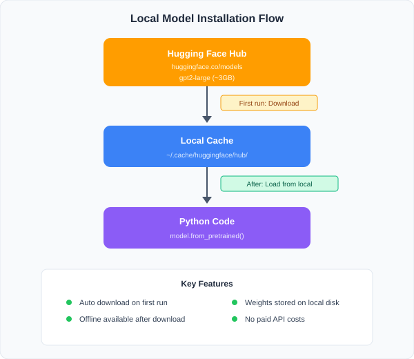

# 모델 설치 가이드 (로컬 설치형)

> Hugging Face Hub에서 LLM을 로컬에 다운로드하여 설치하는 방법

## 1. 개요: 로컬 설치형이란?

이 프로젝트에서 사용하는 LLM은 **클라우드 API가 아닌 로컬 설치형**입니다.



**핵심 특징:**
- 최초 실행 시 인터넷에서 자동 다운로드
- 이후에는 **오프라인에서도 실행 가능**
- 모델 가중치가 로컬 디스크에 저장됨
- OpenAI API 같은 유료 API 비용 없음

## 2. 사전 준비

### 2.1 시스템 요구사항

```bash
# Python 버전 확인 (3.10 이상 권장)
python --version

# pip 최신 버전으로 업데이트
pip install --upgrade pip

# 디바이스 확인 (환경에 따라 선택)
nvidia-smi                    # GPU 서버 (CUDA)
python -c "import torch; print(torch.backends.mps.is_available())"  # 맥북 (MPS)
```

### 2.2 핵심 라이브러리 설치

```bash
# 프로젝트 루트에서 실행
pip install -r requirements.txt
```

또는 개별 설치:

```bash
pip install torch>=2.0.0              # PyTorch (CUDA 포함)
pip install transformers>=4.35.0      # Hugging Face Transformers
pip install datasets>=2.14.0          # 데이터셋 라이브러리
pip install accelerate>=0.24.0        # 분산/혼합정밀 학습 지원
```

### 2.3 (선택) Hugging Face CLI 인증

> GPT-2 계열은 인증 없이 다운로드 가능합니다.
> LLaMA, Mistral 등 게이트드(gated) 모델은 인증이 필요합니다.

```bash
# Hugging Face CLI 설치
pip install huggingface_hub

# 로그인 (https://huggingface.co/settings/tokens 에서 토큰 발급)
huggingface-cli login
```

## 3. 모델 다운로드 방법

### 방법 1: Python 코드에서 자동 다운로드 (권장)

```python
from transformers import AutoModelForCausalLM, AutoTokenizer

# 최초 실행 시 자동으로 다운로드됨
# 캐시에 이미 있으면 즉시 로드
model_name = "gpt2-large"

tokenizer = AutoTokenizer.from_pretrained(model_name)
model = AutoModelForCausalLM.from_pretrained(model_name)

print(f"모델 로드 완료: {model_name}")
print(f"파라미터 수: {sum(p.numel() for p in model.parameters()):,}")
```

### 방법 2: CLI로 미리 다운로드

```bash
# 특정 모델을 미리 다운로드해두기
huggingface-cli download gpt2-large
huggingface-cli download gpt2

# 다운로드 위치 확인
huggingface-cli scan-cache
```

### 방법 3: 특정 디렉토리에 저장

```python
from transformers import AutoModelForCausalLM, AutoTokenizer

model_name = "gpt2-large"
save_dir = "./models/gpt2-large"

# 다운로드 & 특정 경로에 저장
tokenizer = AutoTokenizer.from_pretrained(model_name)
model = AutoModelForCausalLM.from_pretrained(model_name)

tokenizer.save_pretrained(save_dir)
model.save_pretrained(save_dir)

print(f"모델 저장 완료: {save_dir}")
```

```python
# 저장한 모델을 로컬에서 로드
tokenizer = AutoTokenizer.from_pretrained("./models/gpt2-large")
model = AutoModelForCausalLM.from_pretrained("./models/gpt2-large")
```

## 4. 모델별 설치 상세

### 4.1 GPT-2 계열 (인증 불필요)

```bash
# 모두 인증 없이 바로 다운로드 가능
```

```python
# distilgpt2 (82M) - 가장 가벼움
tokenizer = AutoTokenizer.from_pretrained("distilgpt2")
model = AutoModelForCausalLM.from_pretrained("distilgpt2")

# gpt2 (124M) - Student 기본 모델
tokenizer = AutoTokenizer.from_pretrained("gpt2")
model = AutoModelForCausalLM.from_pretrained("gpt2")

# gpt2-medium (345M)
tokenizer = AutoTokenizer.from_pretrained("gpt2-medium")
model = AutoModelForCausalLM.from_pretrained("gpt2-medium")

# gpt2-large (774M) - Teacher 기본 모델
tokenizer = AutoTokenizer.from_pretrained("gpt2-large")
model = AutoModelForCausalLM.from_pretrained("gpt2-large")

# gpt2-xl (1.5B) - 더 강한 Teacher
tokenizer = AutoTokenizer.from_pretrained("gpt2-xl")
model = AutoModelForCausalLM.from_pretrained("gpt2-xl")
```

**GPT-2 토크나이저 주의사항:**

```python
# GPT-2는 pad_token이 없으므로 설정 필요
tokenizer.pad_token = tokenizer.eos_token
```

### 4.2 LLaMA 2 계열 (인증 필요)

**사전 조건:**
1. [Meta LLaMA 이용약관](https://ai.meta.com/llama/) 동의
2. [Hugging Face 모델 페이지](https://huggingface.co/meta-llama/Llama-2-7b-hf)에서 접근 요청
3. 승인 후 HF 토큰으로 인증

```bash
# 1. HF 로그인
huggingface-cli login
# 토큰 입력: hf_XXXXXXXXXXXXX
```

```python
# 2. 모델 다운로드 (승인 후)
from transformers import AutoModelForCausalLM, AutoTokenizer

model_name = "meta-llama/Llama-2-7b-hf"

tokenizer = AutoTokenizer.from_pretrained(model_name)
model = AutoModelForCausalLM.from_pretrained(
    model_name,
    torch_dtype=torch.float16,  # FP16으로 VRAM 절약
    device_map="auto"           # GPU 자동 할당
)
```

### 4.3 TinyLlama (인증 불필요)

```python
model_name = "TinyLlama/TinyLlama-1.1B-Chat-v1.0"

tokenizer = AutoTokenizer.from_pretrained(model_name)
model = AutoModelForCausalLM.from_pretrained(
    model_name,
    torch_dtype=torch.float16,
    device_map="auto"
)
```

### 4.4 Mistral (인증 불필요)

```python
model_name = "mistralai/Mistral-7B-v0.1"

tokenizer = AutoTokenizer.from_pretrained(model_name)
model = AutoModelForCausalLM.from_pretrained(
    model_name,
    torch_dtype=torch.float16,
    device_map="auto"
)
```

## 5. 메모리 최적화 옵션

### 5.1 FP16 로드 (기본 권장)

```python
import torch
model = AutoModelForCausalLM.from_pretrained(
    "gpt2-large",
    torch_dtype=torch.float16
)
# VRAM: ~1.5GB (FP32 대비 절반)
```

### 5.2 8-bit 양자화 (VRAM 부족 시)

```bash
pip install bitsandbytes>=0.41.0
```

```python
model = AutoModelForCausalLM.from_pretrained(
    "gpt2-large",
    load_in_8bit=True,
    device_map="auto"
)
# VRAM: ~0.8GB (FP32 대비 1/4)
```

### 5.3 4-bit 양자화 (극도의 VRAM 절약)

```python
from transformers import BitsAndBytesConfig

quantization_config = BitsAndBytesConfig(
    load_in_4bit=True,
    bnb_4bit_compute_dtype=torch.float16,
    bnb_4bit_quant_type="nf4"
)

model = AutoModelForCausalLM.from_pretrained(
    "meta-llama/Llama-2-7b-hf",
    quantization_config=quantization_config,
    device_map="auto"
)
# 7B 모델을 ~4GB VRAM으로 로드 가능
```

> ⚠️ **주의**: 양자화는 Teacher 모델(추론 전용)에만 적용하세요. Student 모델은 학습해야 하므로 FP16/FP32를 유지해야 합니다.

## 6. 캐시 관리

### 캐시 위치

```bash
# 기본 캐시 경로
ls ~/.cache/huggingface/hub/

# 캐시 크기 확인
du -sh ~/.cache/huggingface/hub/
```

### 캐시 경로 변경

```bash
# 환경변수로 캐시 경로 변경
export HF_HOME=/path/to/custom/cache

# 또는 .bashrc / .zshrc에 추가
echo 'export HF_HOME=/data/hf_cache' >> ~/.zshrc
```

### 캐시 정리

```bash
# 사용하지 않는 모델 캐시 정리
huggingface-cli delete-cache
```

## 7. 설치 검증 스크립트

아래 스크립트로 모든 환경이 정상인지 확인할 수 있습니다:

```python
"""설치 검증 스크립트 — verify_setup.py"""
import sys

def check_environment():
    print("=" * 50)
    print("LLM Knowledge Distillation - 환경 검증")
    print("=" * 50)

    # 1. Python 버전
    print(f"\n[1] Python: {sys.version}")
    assert sys.version_info >= (3, 10), "Python 3.10 이상 필요"
    print("    ✅ OK")

    # 2. PyTorch
    import torch
    print(f"\n[2] PyTorch: {torch.__version__}")
    print(f"    CUDA 사용 가능: {torch.cuda.is_available()}")
    if torch.cuda.is_available():
        print(f"    GPU: {torch.cuda.get_device_name(0)}")
        print(f"    VRAM: {torch.cuda.get_device_properties(0).total_mem / 1e9:.1f} GB")
    print(f"    MPS 사용 가능: {torch.backends.mps.is_available()}")
    if torch.backends.mps.is_available():
        print("    Apple Silicon MPS 백엔드 활성화됨")
    print("    ✅ OK")

    # 3. Transformers
    import transformers
    print(f"\n[3] Transformers: {transformers.__version__}")
    print("    ✅ OK")

    # 4. 모델 로드 테스트
    from transformers import AutoModelForCausalLM, AutoTokenizer
    print("\n[4] 모델 로드 테스트 (gpt2)...")
    tokenizer = AutoTokenizer.from_pretrained("gpt2")
    model = AutoModelForCausalLM.from_pretrained("gpt2")
    param_count = sum(p.numel() for p in model.parameters())
    print(f"    파라미터: {param_count:,}")
    print("    ✅ OK")

    # 5. 디바이스 로드 테스트 (CUDA > MPS > CPU 자동 감지)
    if torch.cuda.is_available():
        device = torch.device("cuda")
        print("\n[5] CUDA GPU 로드 테스트...")
    elif torch.backends.mps.is_available():
        device = torch.device("mps")
        print("\n[5] Apple MPS 로드 테스트...")
    else:
        device = torch.device("cpu")
        print("\n[5] CPU 로드 테스트...")

    model = model.to(device)
    inputs = tokenizer("Hello, world!", return_tensors="pt").to(device)
    with torch.no_grad():
        outputs = model(**inputs)
    print(f"    Device: {device}")
    print(f"    Output shape: {outputs.logits.shape}")
    print("    ✅ OK")

    print("\n" + "=" * 50)
    print("모든 검증 통과! 🎉")
    print("=" * 50)

if __name__ == "__main__":
    check_environment()
```

## 8. 문제 해결 (Troubleshooting)

### CUDA Out of Memory

```
RuntimeError: CUDA out of memory
```

**해결:**
1. `torch_dtype=torch.float16` 사용
2. `batch_size` 줄이기
3. `load_in_8bit=True` 양자화 적용
4. `torch.cuda.empty_cache()` 호출

### 모델 다운로드 실패

```
OSError: We couldn't connect to 'https://huggingface.co'
```

**해결:**
1. 인터넷 연결 확인
2. 프록시 설정 확인: `export HTTPS_PROXY=http://proxy:port`
3. 캐시에서 로드 시도: `local_files_only=True`

### 게이트드 모델 접근 거부

```
OSError: You are trying to access a gated repo
```

**해결:**
1. Hugging Face 로그인: `huggingface-cli login`
2. 모델 페이지에서 접근 요청 & 승인 대기
3. GPT-2 계열은 접근 제한 없음 → 우선 GPT-2로 실험

### pip 패키지 충돌

```bash
# 가상환경 사용 권장
python -m venv venv
source venv/bin/activate  # Linux/Mac
pip install -r requirements.txt
```
