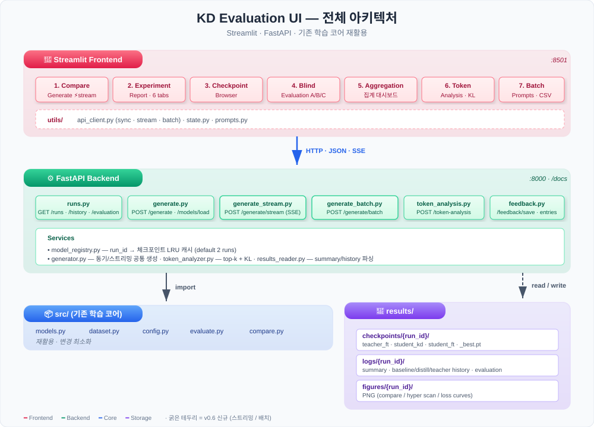

# UI 개발 계획서 — 정성 & 정량 평가 플랫폼

> **목표**: Teacher(FT) / Student(KD) / Student(FT) / Student(Base) 모델의 정성 비교와
> 실험 결과 정량 대시보드를 하나의 웹 UI에서 제공한다.
>
> **스택**: FastAPI (backend) + Streamlit (frontend)
> **위치**: 리포지토리 루트의 `ui/` 폴더 (별도 관리)

---

## 1. 배경 & 목표

### 배경
- 기존 파이프라인은 **정량 평가**(Perplexity, 속도, 메모리)만 자동화되어 있음
- 텍스트 생성의 **정성 평가**는 수동으로 터미널/노트북에서 확인해야 함
- 여러 실험(`results/logs/*/`)의 비교가 PNG 파일을 직접 열어봐야 가능

### 목표
1. 학습된 모델을 **동일 prompt로 비교 생성**
   - **기본 3열**: Teacher(FT) / Student(KD) / Student(FT)
   - **토글로 4열**: Student(Base) 추가 (기본 숨김)
2. **생성 파라미터 조정** (T, top_p, max_tokens 등) 인터랙티브
3. **정성 평가 수집** (블라인드 모드, 리커트, 선호도, 코멘트)
4. **실험 결과 대시보드** (loss 곡선, PPL 비교, run간 diff)
5. **토큰 확률/분포 시각화** (Teacher vs KD 분포 거리 측정)

---

## 2. 전체 아키텍처



### 역할 분담
- **Streamlit (frontend)**: 7개 페이지 UI, 세션 상태, 차트 렌더링, 평가 수집
- **FastAPI (backend)**: 모델 로드/캐시, 동기·스트리밍·배치 생성, 토큰 확률 계산, 결과 JSON 파싱
- **src/ (core)**: 기존 학습 코어 그대로 재활용 (변경 최소화)
- **results/ (storage)**: 체크포인트·history·figures 파일시스템

---

## 3. 폴더 구조

```
ui/
├── README.md                          # 실행법, 설정
├── pyproject.toml                     # UI 전용 의존성 (선택)
├── Makefile                           # make up / make backend / make frontend
├── .env.example                       # PORT, HOST 등
│
├── backend/
│   ├── __init__.py
│   ├── app.py                         # FastAPI 엔트리, lifespan (기본 run 사전 로드)
│   ├── schemas.py                     # Pydantic 모델 (요청/응답)
│   ├── config.py                      # UI 전용 설정 (.env 로드)
│   ├── model_registry.py              # run_id → 체크포인트 매핑, LRU 캐시
│   ├── generator.py                   # 생성 함수 (동기/스트리밍/배치)
│   ├── token_analyzer.py              # 토큰 확률/KL divergence 계산 (v0.5)
│   ├── results_reader.py              # results/logs 파싱
│   ├── storage/                       # 저장소 추상화 (local / Azure Blob)
│   ├── Dockerfile                     # Azure Container Apps 용
│   ├── requirements-azure.txt
│   └── routers/
│       ├── runs.py                    # GET /runs, /runs/{id}/*
│       ├── generate.py                # POST /generate (sync)
│       ├── generate_stream.py         # POST /generate/stream (SSE)  [v0.6]
│       ├── generate_batch.py          # POST /generate/batch          [v0.6]
│       ├── token_analysis.py          # POST /token-analysis          [v0.5]
│       ├── feedback.py                # POST /feedback/save + entries [v0.2/v0.4]
│       └── reports.py                 # figures 프록시                [v0.3]
│
└── frontend/
    ├── app.py                         # Streamlit 엔트리 · st.navigation 기반 라우팅
    ├── home.py                        # 홈 페이지 — Run 선택 / 모델 로드 / 페이지 안내
    ├── utils/
    │   ├── api_client.py              # FastAPI 호출 래퍼 (sync/stream/batch)
    │   ├── state.py                   # session_state 헬퍼
    │   └── prompts.py                 # 프롬프트 템플릿
    └── pages/
        ├── 1_Compare_Generate.py      # 3/4열 비교 + 실시간 스트리밍 토글
        ├── 2_Experiment_Report.py     # loss/PPL/속도/하이퍼/diff
        ├── 3_Checkpoint_Browser.py
        ├── 4_Blind_Evaluation.py
        ├── 5_Aggregation.py           # 블라인드 집계
        ├── 6_Token_Analysis.py        # top-k + KL divergence
        └── 7_Batch_Prompts.py         # CSV 업로드 배치 생성  [v0.6]
```

---

## 4. API 명세

### 4.1 `GET /runs`
학습 결과가 있는 run_id 목록을 반환.
**소스**: `results/logs/{run_id}/summary.json` 을 스캔 (config + results 한 파일에 모두 있음).

`summary.json` 실제 구조 (예):
```json
{
  "run_id": "20260410_041631",
  "config": { "teacher_model": "gpt2", "student_model": "distilgpt2",
               "temperature": 2.0, "alpha": 0.2, "epochs": 8, ... },
  "results": {
    "Teacher (FT)":   { "ppl": 25.1, "tokens_per_sec": 14023 },
    "Student (KD)":   { "ppl": 32.4, "tokens_per_sec": 22075 },
    "Student (FT)":   { "ppl": 32.8, "tokens_per_sec": 21944 },
    "Student (Base)": { "ppl": 65.3, "tokens_per_sec": 22130 }
  },
  "diagnosis": [...]
}
```

**Response** (API 변환 결과)
```json
[
  {
    "run_id": "20260410_041631",
    "created_at": "2026-04-10T04:16:31",
    "teacher_model": "gpt2",
    "student_model": "distilgpt2",
    "checkpoints": {
      "teacher_ft":   true,
      "student_kd":   true,
      "student_ft":   true,
      "student_base": true
    },
    "hyperparams": { "temperature": 2.0, "alpha": 0.2, "epochs": 8 },
    "results": {
      "teacher_ft":   { "ppl": 25.1, "tokens_per_sec": 14023 },
      "student_kd":   { "ppl": 32.4, "tokens_per_sec": 22075 },
      "student_ft":   { "ppl": 32.8, "tokens_per_sec": 21944 },
      "student_base": { "ppl": 65.3, "tokens_per_sec": 22130 }
    }
  }
]
```

> **모델 ID 네이밍 규칙**: 체크포인트 파일명과 1:1 대응. `teacher_ft` ↔ `teacher_ft_best.pt`,
> `student_kd` ↔ `student_kd_best.pt`, `student_ft` ↔ `student_ft_best.pt`,
> `student_base` ↔ 체크포인트 없음(pretrained 그대로 로드).

### 4.2 `POST /models/load`
특정 run의 체크포인트를 메모리에 로드.

**Request**
```json
{ "run_id": "20260410_041631", "models": ["teacher_ft", "student_kd", "student_ft", "student_base"] }
```

**Response**
```json
{ "loaded": ["teacher_ft", "student_kd", "student_ft", "student_base"], "memory_mb": 1234.5 }
```

### 4.3 `POST /generate`
여러 모델로 동시 생성.

**Request**
```json
{
  "run_id": "20260410_041631",
  "model_ids": ["teacher_ft", "student_kd", "student_ft"],
  "prompt": "The history of AI",
  "params": {
    "max_new_tokens": 100,
    "temperature": 0.8,
    "top_p": 0.9,
    "top_k": 50,
    "repetition_penalty": 1.1,
    "do_sample": true,
    "seed": 42
  }
}
```

**Response**
```json
{
  "outputs": {
    "teacher_ft": { "text": "...", "tokens_per_sec": 120.5, "elapsed_ms": 830, "num_tokens": 100 },
    "student_kd": { "text": "...", "tokens_per_sec": 210.2, "elapsed_ms": 475, "num_tokens": 100 },
    "student_ft": { "text": "...", "tokens_per_sec": 208.7, "elapsed_ms": 479, "num_tokens": 100 }
  }
}
```

### 4.4 `POST /generate/stream` (v0.6)
SSE로 토큰 단위 스트리밍. 모델마다 별도 스레드에서 `TextIteratorStreamer` 로 생성하고,
하나의 이벤트 큐로 병합해 **`text/event-stream`** 응답으로 내보낸다 (헤더 `X-Accel-Buffering: no`).

**Request**: `/generate` 와 동일 (`run_id`, `model_ids`, `prompt`, `params`).

**Event payload** (SSE `data:` 라인당 JSON 1개):
```jsonc
{"event":"start", "model_id":"student_kd"}
{"event":"token", "model_id":"student_kd", "text":" of"}
{"event":"token", "model_id":"teacher_ft", "text":" the"}
{"event":"done",  "model_id":"student_kd", "num_tokens":100, "elapsed_ms":472, "tokens_per_sec":211.8}
{"event":"error", "model_id":"student_ft", "message":"..."}
```
모든 모델이 `done` 또는 `error` 를 내보내면 센티넬로 스트림 종료.

### 4.5 `GET /runs/{run_id}/history`
학습 로그(`baseline_history.json`, `distill_history.json`, `teacher_history.json`) 통합 반환.

### 4.6 `GET /runs/{run_id}/evaluation`
`evaluation_results.json` 파싱 반환 (4-Way PPL/속도/메모리).

### 4.7 `POST /token-analysis` (v0.5)
주어진 prompt의 **각 위치에서 top-k 토큰과 확률**을 모델별로 반환.
Teacher vs KD의 KL divergence 포함.

**Response (요약)**
```json
{
  "positions": [
    {
      "context": "The cat",
      "top_k": {
        "teacher_ft": [{"token": "sat", "prob": 0.32}, ...],
        "student_kd": [{"token": "sat", "prob": 0.29}, ...],
        "student_ft": [{"token": "was", "prob": 0.25}, ...]
      },
      "kl_teacher_kd": 0.045,
      "kl_teacher_ft": 0.182
    }
  ]
}
```

### 4.8 `POST /generate/batch` (v0.6)
여러 prompt × 여러 모델을 **한 번의 호출**로 일괄 생성 (최대 200 prompt).

**Request**
```json
{
  "run_id": "20260410_041631",
  "model_ids": ["teacher_ft", "student_kd", "student_ft"],
  "prompts": ["The capital of France is", "Machine learning is", "..."],
  "params": { "max_new_tokens": 30, "temperature": 0.8, "top_p": 0.9, "seed": 42 }
}
```

**Response**
```json
{
  "run_id": "20260410_041631",
  "count": 50,
  "items": [
    {
      "prompt": "The capital of France is",
      "outputs": {
        "teacher_ft": { "text": "...", "tokens_per_sec": 12.1, "elapsed_ms": 2480, "num_tokens": 30 },
        "student_kd": { "text": "...", "tokens_per_sec": 70.5, "elapsed_ms": 425,  "num_tokens": 30 },
        "student_ft": { "text": "...", "tokens_per_sec": 71.1, "elapsed_ms": 421,  "num_tokens": 30 }
      }
    }
  ]
}
```

---

## 5. 페이지별 기능

### 5.1 Home (`frontend/home.py`)
**설정 컨트롤 센터**

- 상단 헤더: 프로젝트 소개 + Backend 상태 배지 (device 표시)
- **⚙️ 설정 섹션** — 본문 최상단 (스크롤 없이 바로 보임)
  - Run ID selectbox (`results/logs/` 자동 스캔)
  - `Student (Base) 포함 (4열)` 토글
  - `모델 로드` 버튼 (primary) — 선택된 run 의 체크포인트를 메모리에 로드
  - 우측 카드: 선택된 run 정보 (Teacher/Student 모델, 생성 시각, 누락 체크포인트 경고, 하이퍼파라미터 expander)
- **빠른 시작** — Run / 모델 / Device 메트릭 + Compare Generate 바로가기
- **페이지 안내** — 3열 (생성 / 평가 / 분석) `st.page_link` 리스트
- **모델 네이밍 규칙** (expander)

> **사이드바 정책**: 사이드바는 `st.navigation` 기반 네비게이션 **전용** (그룹: 🧪 생성 / 📝 평가 / 🔬 분석). 설정은 홈 본문에만 배치 — 네비와 설정의 시각적 충돌 방지.

### 5.2 🆚 Compare Generate
**정성 비교 메인 페이지**

- 상단: 프롬프트 입력 영역
  - 큰 textarea
  - Prompt 템플릿 드롭다운 (6~8개 샘플)
  - `Run` 버튼 + **`⚡ 실시간 스트리밍` 토글** (v0.6) — 켜면 `/generate/stream` SSE 로 토큰 단위 누적 표시, 끄면 `/generate` 동기 호출
- 우측 패널: 생성 파라미터
  - 슬라이더: max_tokens, T, top_p, top_k, rep_penalty
  - 토글: do_sample, common_params (공통 vs 모델별)
  - 숫자: seed
  - Preset 드롭다운: Conservative / Balanced / Creative
- 가운데: 결과 **기본 3열** (Teacher FT / Student KD / Student FT)
  - **`Include Student(Base)` 토글** → 켜면 4열로 확장
  - 각 열 헤더: 모델명 + 파라미터 수 + latency + tokens/sec
  - 본문: 생성 텍스트 (코드 블록 스타일)
  - 하단: 복사, "이 출력으로 다시 prompt", 평가 (5점)
- 결과 저장:
  - `Save to session` 버튼 → `st.session_state.history` 누적
  - `Download JSONL` 다운로드 버튼

### 5.3 🕶️ Blind Evaluation
**편향 없는 정성 평가**

- 블라인드 ON/OFF 토글
- 프롬프트 입력 → 모델명 **숨김** + 순서 랜덤 셔플
- `Model A / B / C` 로 표시
- 각 열 하단:
  - 리커트 척도 (유창성/일관성/사실성/창의성 1~5점)
  - 전체 선호도 라디오 (A / B / C / 차이 없음)
  - 자유 코멘트
- `Submit` 누르면 정답 공개 + `results/qualitative/{run_id}/blind.jsonl` 저장

### 5.4 📈 Aggregation
**누적된 정성 평가 JSONL 집계 대시보드**

- Run / 평가 모드(compare · blind) 필터
- 서버에 저장된 `feedback/entries` 조회 · blind는 `blind_mapping` 역매핑으로 실제 model_id 복원
- 3개 탭
  - **선호도**: "n=N 중 KD 선호 k회 (%)" · 모델별 선호 비율 bar
  - **리커트 평균**: 유창성/일관성/사실성/창의성 4축 bar · radar
  - **원본 entries**: raw JSONL 테이블

### 5.5 📊 Experiment Report
**정량 실험 결과 대시보드**

- Run 멀티 셀렉트: 여러 run을 체크박스로 겹쳐보기
- 탭 구조:
  - **Loss 곡선**
    - Teacher FT loss (epoch vs loss, val loss)
    - Distill loss (total/ce/kd 분해)
    - Baseline loss
    - 여러 run 겹치기 + 범례
    - Plotly 인터랙티브 (줌/호버)
  - **PPL 비교**
    - 4-Way 막대그래프 (Plotly)
    - Q1/Q2/Q3 자동 계산 카드
    - `results/figures/{run}/` 의 PNG 원본도 임베드 (기존 compare.py 결과 재활용)
  - **속도 & 메모리**
    - tokens/sec 비교
    - 파라미터 수 비교
  - **하이퍼파라미터 스캔**
    - 전체 run을 scatter plot: x=α, y=T, color=best PPL
    - 최적 조합 하이라이트
  - **Run Diff**
    - 두 run 선택 → config/결과 차이 표

### 5.6 🔬 Token Analysis
**토큰 확률 분포 시각화** (연구용)

- 프롬프트 입력 → `Analyze` 버튼
- 출력: 생성된 각 토큰 위치마다
  - Top-5 토큰과 확률 막대
  - Teacher / KD / FT 3개 분포 나란히
  - **KL(Teacher ∥ KD)** 와 **KL(Teacher ∥ FT)** 값 표시
- 요약 지표:
  - 시퀀스 전체 평균 KL (Teacher vs KD) vs (Teacher vs FT)
  - **"KD가 FT보다 Teacher에 더 가까운가?"** 정량 증거
- 토큰 선택 → 그 위치의 전체 vocab 분포 히스토그램

### 5.7 💾 Checkpoint Browser
**체크포인트 탐색**

- `results/checkpoints/` 트리 뷰
- run별 카드:
  - run_id, 생성 시각, config 이름
  - 3~4 체크포인트 존재 여부 (√/×)
  - 파일 크기, 파라미터 수
  - `Load this run` 버튼
- 현재 로드된 run 하이라이트

### 5.8 📦 Batch Prompts (v0.6)
**CSV/텍스트 배치 생성**

- 탭 1 — **CSV 업로드**
  - `st.file_uploader` → pandas 로 파싱
  - 헤더에 `prompt` 컬럼이 있으면 사용, 없으면 첫 컬럼을 prompt 로 해석
  - 샘플 파일: [`examples/sample_batch_prompts.csv`](../examples/sample_batch_prompts.csv) — 50 prompt × 6 카테고리
- 탭 2 — **텍스트 입력**
  - 줄바꿈으로 구분한 프롬프트 리스트
- 생성 파라미터 expander (Preset / max_tokens / T / top_p / top_k / rep_penalty / seed)
- 실행
  - `st.progress` 진행률 바 (prompt 단위로 /generate/batch 를 서버에 반복 호출하여 UX 용 진행률 확보)
  - 모델별 평균 tokens/sec 요약 표
- 결과 다운로드
  - CSV (평탄화된 prompt × model)
  - JSONL (원본 응답)
  - 특정 index 선택 → 해당 prompt 의 모델별 상세 보기

---

## 6. 핵심 기술 결정

### 6.1 모델 로드 전략
- FastAPI `lifespan` 에서 **기본 run 1개** 로드 (환경변수 `DEFAULT_RUN_ID`, 없으면 `results/logs/` 중 최신 run)
- `/models/load` 로 다른 run 스왑
- LRU 캐시: **최대 2개 run** 동시 보유 (메모리 여유 시)
- CPU/MPS 기본, CUDA 있으면 자동 사용 ([src/config.py:get_device](../src/config.py) 재활용)

**각 run 내부의 모델 구성 결정 방식**:
1. `summary.json` 의 `config.teacher_model`, `config.student_model` 읽음
2. `AutoModelForCausalLM.from_pretrained(teacher_model)` 로 아키텍처 생성
3. `torch.load(ckpt, map_location="cpu", weights_only=True)` → `load_state_dict()` → `.to(device)` → `.eval()`
   - 기존 [src/models.py:load_teacher](../src/models.py) 패턴 그대로 재사용
4. `student_base` 는 state_dict 로드 생략 (pretrained만)

**Tokenizer 캐시** (별도 관리):
- Teacher, Student가 다른 계열일 수 있음 → run별로 최대 2개 토크나이저 로드 가능성
- 실제로는 GPT-2 계열 공유 → `tokenizer_cache[model_name]` dict로 캐싱
- `pad_token = eos_token` 보정도 한 번만 (기존 [src/dataset.py:load_tokenizer](../src/dataset.py) 재사용)

### 6.2 동시 생성
- 같은 prompt를 3~4 모델에 순차 호출 (단순)
- v0.2+: `asyncio.gather` + ThreadPoolExecutor로 병렬화
- GPU 메모리 부족 시 순차 fallback

### 6.3 스트리밍 (v0.5+)
- `transformers.TextIteratorStreamer` + 별도 스레드
- FastAPI `StreamingResponse` with `text/event-stream`
- 3 모델 스트림은 단일 SSE에 `{"model_id": "kd", "token": "..."}` 형태로 병합
- Streamlit에서 `st.write_stream` + 열별 placeholder

### 6.4 세션 상태
- 이번 세션의 모든 생성/평가를 `st.session_state["history"]` 에 누적
- 페이지 이동해도 유지
- 저장은 수동 (`Download JSONL` 버튼)
- 선택: 자동 저장 옵션

### 6.5 결과 저장 경로
```
results/
├── qualitative/
│   └── {run_id}/
│       ├── session_{timestamp}.jsonl     # 일반 평가
│       └── blind_{timestamp}.jsonl       # 블라인드 평가
```

### 6.6 차트 라이브러리
- **Plotly**: 인터랙티브 (loss 곡선, scatter, hover)
- **matplotlib**: 기존 `compare.py` 출력 재활용 (`st.image(png_path)`)

### 6.7 의존성 관리
루트 `pyproject.toml` 에 UI extras 추가 (실제 패치):
```toml
[project.optional-dependencies]
ui = [
    "fastapi>=0.110.0",
    "uvicorn[standard]>=0.27.0",
    "streamlit>=1.32.0",
    "plotly>=5.18.0",
    "httpx>=0.27.0",       # Streamlit → FastAPI 호출
    "python-dotenv>=1.0.0",  # .env 로드
]
```
- 설치: `uv sync --extra ui`
- `ui/` 는 라이브러리 의존성을 가지지 않고 `from src.xxx import ...` 로 기존 코드 재활용

---

## 7. 단계별 마일스톤

### v0.1 MVP — 핵심 경로 뚤기 ✅ **완료 (2026-04-24)**
**목표: 3열 비교 생성이 돌다**

- [x] `ui/` 폴더 스캐폴딩, Makefile, README
- [x] FastAPI 앱 + `lifespan` 모델 로드
- [x] `/runs`, `/models/load`, `/generate` 엔드포인트
- [x] Streamlit 홈 + Compare Generate 페이지
- [x] 기본 파라미터 슬라이더 (max_tokens, T, top_p, top_k, rep_penalty, seed)
- [x] Base 토글
- [x] 모델 로드 + 생성 통합 테스트 (MPS, 3모델 동시 생성 성공)

### v0.2 — 정성 평가 정식화 ✅ **완료 (2026-04-24)**
**목표: 평가 데이터를 수집할 수 있다**

- [x] Prompt 템플릿 드롭다운
- [x] 세션 누적 + JSONL 다운로드
- [x] 리커트 평가 + 선호도 + 코멘트 UI
- [x] 결과 저장 (`/feedback/save` 서버 저장, JSONL 다운로드 둘 다 지원)

### v0.3 — 정량 리포트 통합 ✅ **완료 (2026-04-24)**
**목표: 실험 결과를 한 곳에서 본다**

- [x] `/runs/{id}/history`, `/runs/{id}/evaluation`, `/runs/{id}/figures`, `/runs/{id}/figures/{filename}` 엔드포인트
- [x] Experiment Report 페이지 (Loss 곡선 overlay · PPL 비교 · 속도/메모리 · 하이퍼파라미터 스캔 · PNG 임베드 · Run Diff 6개 탭)
- [x] Checkpoint Browser 페이지 (카드 그리드 · 검색/필터 · 로드 버튼)
- [x] Q1/Q2/Q3 자동 계산 카드

### v0.4 — 블라인드 평가 ✅ **완료 (2026-04-24)**
**목표: 편향 없는 평가를 할 수 있다**

- [x] Blind Evaluation 페이지 (A/B/C 셔플 · 리커트 · 선호도 · 코멘트)
- [x] 순서 셔플 + 모델명 마스킹 + "정답 공개" 토글
- [x] `/feedback/{run_id}/entries` 엔드포인트 (mode 필터)
- [x] Aggregation 페이지 — 선호도 집계 / 리커트 평균(Bar·Radar) / blind_mapping 역매핑

### v0.5+ — 연구용 분석 (진행 중)
**목표: 논문/보고서에 넣을 깊이 있는 지표를 뽑는다**

- [x] `/token-analysis` 엔드포인트 (top-k + Teacher∥Student KL divergence)
- [x] Token Analysis 페이지
- [x] Top-k 분포 시각화 (수평 bar, 정답 토큰 하이라이트, 정답 rank 표시)
- [x] Teacher vs KD/FT KL divergence 차트 (요약 메트릭 + position별 라인)
- [x] Hyperparameter 스캔 차트 (Report 페이지에 포함됨)

### v0.6 — 실시간 스트리밍 & 배치 처리 ✅ **완료 (2026-04-24)**
**목표: 긴 생성의 체감 지연을 줄이고, 대규모 prompt 평가를 일괄 처리한다**

- [x] `/generate/stream` SSE 엔드포인트 (모델별 스레드 + `TextIteratorStreamer` + 이벤트 병합)
- [x] Compare Generate 페이지에 `⚡ 실시간 스트리밍` 토글 — 토큰 누적 + `▌` 커서, 완료 시 tokens/sec 표시
- [x] `/generate/batch` 엔드포인트 (≤200 prompt × 다수 모델)
- [x] Batch Prompts 페이지 — CSV 업로드 / 멀티라인 텍스트, 진행률 바, CSV·JSONL 다운로드
- [x] 샘플 데이터 `examples/sample_batch_prompts.csv` (50 prompt × 6 카테고리)

### v0.7 — Azure 배포 & 저장소 추상화 ✅ **완료 (2026-05-05)**
**목표: 학습 서버와 UI 호스팅을 분리하고, 클라우드에 배포해서 팀원과 공유한다**

- [x] `ui/backend/storage/` — `local` / `blob` 두 백엔드 (환경변수 `STORAGE_BACKEND` 로 전환)
  - `LocalStorage`: 기존 `results/` 폴더 직접 read
  - `BlobStorage`: Azure Blob + 디스크 LRU 캐시 (`/tmp/kd-cache`, `AZURE_BLOB_CACHE_MAX_GB`)
- [x] `model_registry`, `results_reader`, `feedback`, `reports` — 4 모듈을 storage 추상화로 마이그레이션
- [x] `infra/` — Bicep IaC (`main.bicep` + `prereqs.bicep` + `apps.bicep`)
  - VNet 통합 ManagedEnv, Storage Private Endpoint, UAMI, ACR
  - 2단계 배포: `prereqs` (인프라 + 권한) → `apps` (Container Apps)
- [x] `infra/deploy.sh` — `prereqs|apps|all` 래퍼, 네트워크 사전 리소스 멱등 보장
- [x] `scripts/build_and_push.sh` — 클라우드 빌드(`az acr build`), `/tmp/kd-ctx` 스테이징
- [x] `scripts/sync_to_azure.sh` — 학습 서버 → Blob 업로드 (run 단위 또는 전체)
- [x] PNG 차트 inline 응답 (PE 환경에서 SAS redirect 불가 대응)
- [x] Home 페이지 사용 가이드 탭 (`📊 대시보드` / `📖 사용 가이드` 2탭)

### 후순위 (필요시)
- [ ] Attention 히트맵
- [x] Docker 이미지 (Container Apps 대상)  — v0.7에서 완료
- [ ] 인증/외부 공유 모드 (Container Apps Authentication 설정 안내만 존재)

---

## 8. 실행법 (계획)

### 개발 모드
```bash
# 백엔드 (터미널 1)
make backend
# → uvicorn ui.backend.app:app --reload --port 8000

# 프론트엔드 (터미널 2)
make frontend
# → streamlit run ui/frontend/app.py --server.port 8501

# 또는 한 번에
make up
```

### 환경변수
```env
# ui/.env
API_HOST=0.0.0.0
API_PORT=8000
UI_PORT=8501
DEFAULT_RUN_ID=20260410_041631
MODEL_CACHE_SIZE=2
DEVICE=auto
```

---

## 9. 위험 요소 & 대응

| 위험 | 영향 | 대응 |
|---|---|---|
| MPS/CUDA 메모리 부족 (4모델 동시) | 생성 실패 | 순차 생성 fallback, run 1개만 기본 로드 |
| 모델 로드 시간 (~수 초) | UX 저하 | lifespan 선로드, 로딩 인디케이터, 캐시 |
| `torch.load` weights_only 경고 | 경고 스팸 | `weights_only=True` 명시 (기존 코드와 동일) |
| Streamlit 전체 재실행 | 성능 저하 | `@st.cache_data`, API 분리된 상태에선 큰 문제 없음 |
| 토큰 확률 계산 비용 (v0.5) | 느림 | 옵트인 (버튼), prompt 길이 제한 |
| 포트 충돌 | 실행 실패 | `.env` 로 조정, README에 명시 |
| MPS에서 `map_location` 오류 | 로드 실패 | 항상 `map_location="cpu"` → `.to(device)` 순서 |
| 체크포인트가 없는 run | 목록 오염 | `summary.json` 존재 & 체크포인트 파일 존재 모두 검사 |
| Run 0개 (신규 환경) | UI 빈 화면 | Empty state 처리 (아래 참조) |

### 9.1 Empty State 처리
- `/runs` 가 빈 배열이면 홈 페이지에서 안내 카드 표시:
  - "아직 학습된 모델이 없습니다. `uv run python main.py configs/exp02_local_longer.yaml` 으로 파이프라인 실행 후 다시 접속하세요."
- Compare Generate / Blind Evaluation 페이지는 비활성화 + 홈으로 유도
- Experiment Report 페이지는 여전히 표시 (빈 리스트)

---

## 10. 산출물 체크리스트

### MVP 완료 기준
- [ ] `make up` 으로 두 프로세스 기동
- [ ] 브라우저에서 `localhost:8501` 접속
- [ ] Run 선택 → 모델 로드 → Prompt 입력 → 3 모델 결과 표시
- [ ] 각 열의 latency/tokens-per-sec 확인 가능
- [ ] Base 토글 동작
- [ ] 기본 README 문서화

### 전체 완료 기준
- [ ] 5개 페이지 모두 동작
- [ ] 블라인드 평가로 JSONL 수집 가능
- [ ] Experiment Report에서 기존 모든 run 비교 가능
- [ ] Token Analysis로 KL divergence 지표 확인 가능
- [ ] README + 스크린샷 보강

---

## 11. 참고

- **기존 코드 재활용**: [src/models.py](../src/models.py), [src/evaluate.py](../src/evaluate.py), [src/compare.py](../src/compare.py)
- **기존 결과 경로**: `results/checkpoints/`, `results/logs/`, `results/figures/`
- **FastAPI 문서**: https://fastapi.tiangolo.com/
- **Streamlit 멀티페이지**: https://docs.streamlit.io/library/get-started/multipage-apps

---

## 변경 이력

| 날짜 | 버전 | 내용 |
|---|---|---|
| 2026-04-24 | 0.1 | 초안 작성 — 전체 계획 수립 |
| 2026-04-24 | 0.2 | v0.1 MVP 구현 완료 (FastAPI backend + Streamlit frontend 3열 비교 생성) |
| 2026-04-24 | 0.3 | v0.2 정성 평가 완료 (리커트/선호도 UI + /feedback/save + JSONL 다운로드) |
| 2026-04-24 | 0.4 | v0.3 완료 (Experiment Report 6탭 + Checkpoint Browser + figures 엔드포인트) |
| 2026-04-24 | 0.5 | v0.4 완료 (Blind Evaluation + Aggregation + /feedback entries 조회) |
| 2026-04-24 | 0.6 | v0.5 백엔드 착수 (/token-analysis — top-k + KL divergence) |
| 2026-04-24 | 0.7 | v0.5 완료 (Token Analysis 페이지 — top-k bar + KL 차트 + 정답 rank) |
| 2026-04-24 | 0.8 | v0.6 완료 (SSE 실시간 스트리밍 `/generate/stream` + Compare Generate 토글 UI + 배치 처리 `/generate/batch` + Batch Prompts 페이지 — CSV 업로드/텍스트 입력, 진행률, 결과 CSV/JSONL 다운로드; 샘플 `examples/sample_batch_prompts.csv` 50개 prompt 6 카테고리) |
| 2026-05-05 | 0.9 | v0.7 완료 (저장소 추상화 local/blob · 4 모듈 마이그레이션 · Bicep IaC + deploy.sh · Azure Container Apps 배포 · sync_to_azure.sh · PNG inline 응답 · Home 가이드 탭) |
