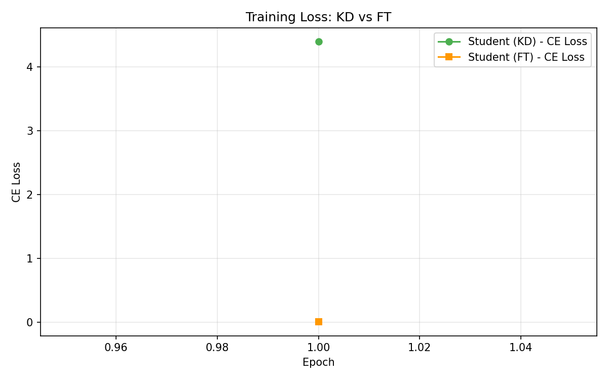
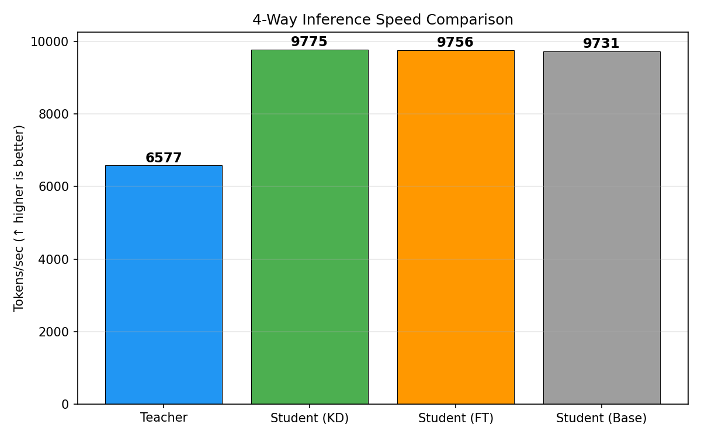
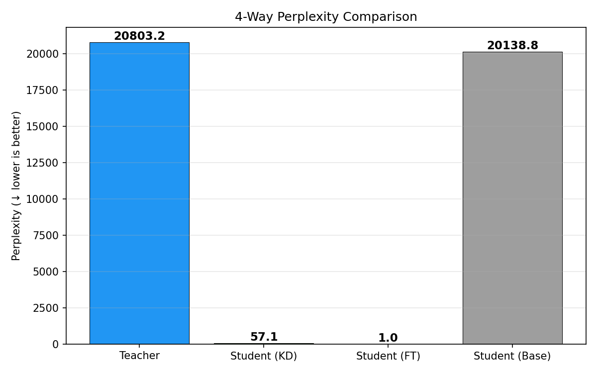

# 실험 노트 — 20260403_local_test

## 자동 진단

- ⚠️ Teacher PPL=20803 — 비정상적으로 높음 (패딩 과다 또는 미학습)
- ⚠️ Student (FT) PPL=1.00 — 과적합 의심 (패딩 토큰 예측으로 loss 왜곡 가능)
- ⚠️ Student (Base) PPL=20139 — 비정상적으로 높음 (패딩 과다 또는 미학습)
- ⚠️ KD(57.08) >= FT(1.00) — 증류 효과 미확인
- ⚠️ 1 epoch만 실행 — 수렴 전 평가일 수 있음
- ⚠️ max_seq_length=128 — 패딩 비율 높을 수 있음

## 다음 액션

- [ ] temperature 값 조정 (현재 → +2 시도)
- [ ] alpha 값 낮추기 (CE 비율 줄이기)
- [ ] epochs를 3~5로 늘려서 수렴 확인
- [ ] max_seq_length를 512로 올려서 패딩 비율 줄이기
- [ ] GPU 서버에서 server_config()로 본 실험 수행

## 메모

### 1. 실험 조건 요약

| 항목 | 값 |
|---|---|
| Teacher | gpt2 (124M, 497.8MB) |
| Student | distilgpt2 (82M, 327.7MB) |
| 압축률 | 파라미터 34% 감소, 용량 34% 감소 |
| Temperature | 3.0 |
| Alpha (α) | 0.5 → KD Loss = 0.5·CE + 0.5·T²·KL |
| Epochs | 1 |
| Batch Size | 2 |
| max_seq_length | 128 |
| Device | Apple MPS (MacBook) |

### 2. PPL 수치가 비정상인 이유 — 패딩 토큰 문제

이번 테스트의 가장 큰 문제는 **max_seq_length=128**로 인한 패딩 과다이다.

- WikiText-2의 문장 대부분은 128 토큰보다 짧음 → 각 샘플의 상당 부분이 `pad_token`
- GPT-2는 원래 `pad_token`이 없어서 `eos_token`을 `pad_token`으로 재사용
- 결과적으로 모델이 **유의미한 텍스트가 아니라 패딩을 예측**하는 비중이 높아짐

이것이 수치에 미친 영향:

| 모델 | PPL | avg_loss | 해석 |
|---|---|---|---|
| **Teacher (gpt2)** | 20,803 | 9.94 | 사전학습된 gpt2가 패딩 포함 시퀀스에서 높은 loss → PPL 폭등 |
| **Student (KD)** | 57.08 | 4.04 | KD 학습으로 어느 정도 적응했지만 1 epoch로는 부족 |
| **Student (FT)** | **1.00** | 0.00004 | CE-only 학습이 패딩 패턴을 거의 완벽히 암기 → **과적합** |
| **Student (Base)** | 20,139 | 9.91 | 미학습 distilgpt2, Teacher와 비슷하게 높음 |

> **핵심**: FT의 PPL=1.0은 "완벽한 모델"이 아니라 **패딩 토큰 암기**의 결과.
> 실제 텍스트 생성 품질과는 무관한 지표 왜곡이다.

### 3. KD vs FT 학습 비교

| 지표 | KD (증류) | FT (Fine-tune) |
|---|---|---|
| 학습 시간 | 1,304초 (~22분) | 933초 (~15분) |
| Train CE Loss | 4.40 | 0.010 |
| Val CE Loss | 4.09 | 0.00009 |
| Train KD Loss | 36.83 | — |
| Train Total Loss | 20.62 | — |

**관찰:**
- FT가 KD보다 **7분 빠른 이유**: KD는 매 배치마다 Teacher forward pass가 추가로 필요 (gpt2 124M → 약 40% 오버헤드)
- FT의 CE Loss가 0.01까지 급격히 떨어진 것은 패딩 패턴 학습이 쉽기 때문
- KD의 CE Loss=4.40은 합리적인 범위이나, KD Loss=36.83이 높음 → T=3.0에서 Teacher-Student 분포 차이가 아직 큼

### 4. 추론 속도 비교

| 모델 | Tokens/sec | ms/token | 모델 크기 |
|---|---|---|---|
| Teacher (gpt2) | 6,577 | 0.152 | 497.8 MB |
| Student (KD) | 9,775 | 0.102 | 327.7 MB |
| Student (FT) | 9,756 | 0.103 | 327.7 MB |
| Student (Base) | 9,731 | 0.103 | 327.7 MB |

**관찰:**
- Student 모델들은 Teacher 대비 **약 1.49배 빠름** (9,775 / 6,577)
- Student 3종 간 속도 차이는 거의 없음 (44 tok/s 이내) → 가중치 값이 달라도 아키텍처가 같으면 속도 동일
- 이 속도 차이는 순수히 **파라미터 수 차이** (124M vs 82M)에서 기인
- MPS 환경에서도 distilgpt2의 경량화 효과가 명확히 확인됨

### 5. Perplexity 분포

차트에서 Teacher(20,803)와 Base(20,139)가 거의 같은 높이로 보이고, KD(57)와 FT(1)는 바닥에 붙어 있다.
**이 차트는 패딩 왜곡 때문에 의미 있는 비교가 어렵다.** 서버 실험(seq=512, epochs≥3)에서 재생성 필요.

### 6. 파이프라인 검증 결과

이번 로컬 테스트의 **진짜 목적은 코드 검증**이었고, 그 관점에서는 성공:

- [x] config → dataset → models → distill → train_baseline → evaluate → compare 전체 파이프라인 정상 동작
- [x] MPS 디바이스에서 학습/추론 모두 동작 확인
- [x] 체크포인트 저장/로드 정상 (MPS "Unaligned blit" 버그 우회 완료)
- [x] run_id 기반 결과 디렉토리 분리 정상
- [x] 자동 진단 + summary.json + notes.md 생성 정상
- [x] 4-Way 비교 차트(PPL, Speed, Training Loss) 생성 정상

### 7. 서버 본실험에서 바꿔야 할 것

| 항목 | 현재 (local) | 서버 목표 | 이유 |
|---|---|---|---|
| max_seq_length | 128 | **512** | 패딩 비율을 줄여 PPL 왜곡 제거 |
| epochs | 1 | **3~5** | 수렴 여부 확인, KD Loss 감소 추이 관찰 |
| batch_size | 2 | **8~16** | GPU 메모리 활용 극대화 |
| teacher | gpt2 (124M) | **gpt2-large (774M)** | Teacher-Student 용량 갭 확대 → KD 효과 극대화 |
| student | distilgpt2 (82M) | **gpt2 (124M)** | 더 큰 Student로 지식 수용 능력 확보 |
| temperature | 3.0 | **3.0 → 5.0 비교** | T 값에 따른 soft distribution 차이 실험 |
| alpha | 0.5 | **0.3 → 0.7 sweep** | CE vs KL 비중 최적점 탐색 |

### 8. 결론

> **이번 로컬 테스트는 "코드가 돌아가는가"를 검증하는 smoke test로서 목적 달성.**
> PPL 수치 자체는 패딩 왜곡으로 신뢰할 수 없으며, 모델 품질 비교는 서버 본실험에서 수행해야 한다.
> 다만 추론 속도 비교(Teacher 6,577 vs Student 9,775 tok/s, **1.49배**)는 유효한 결과이다.

