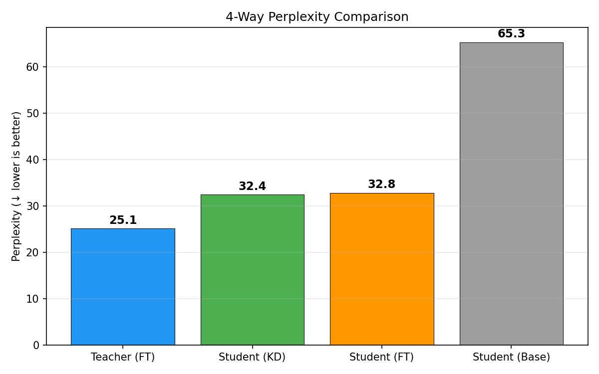
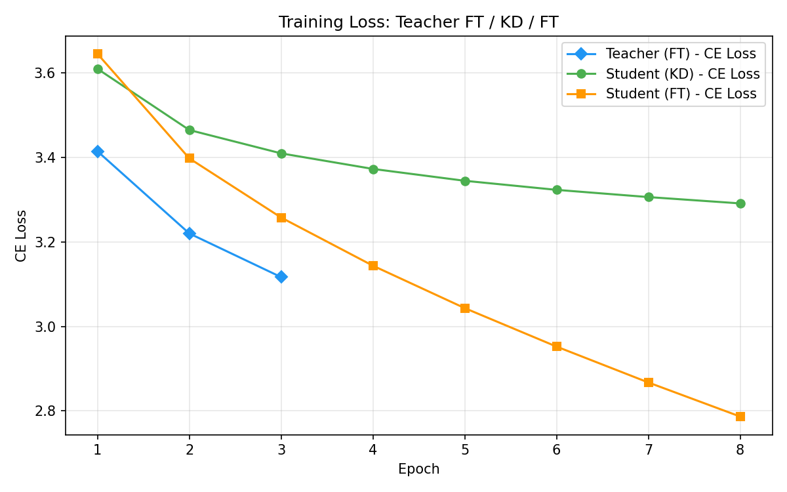
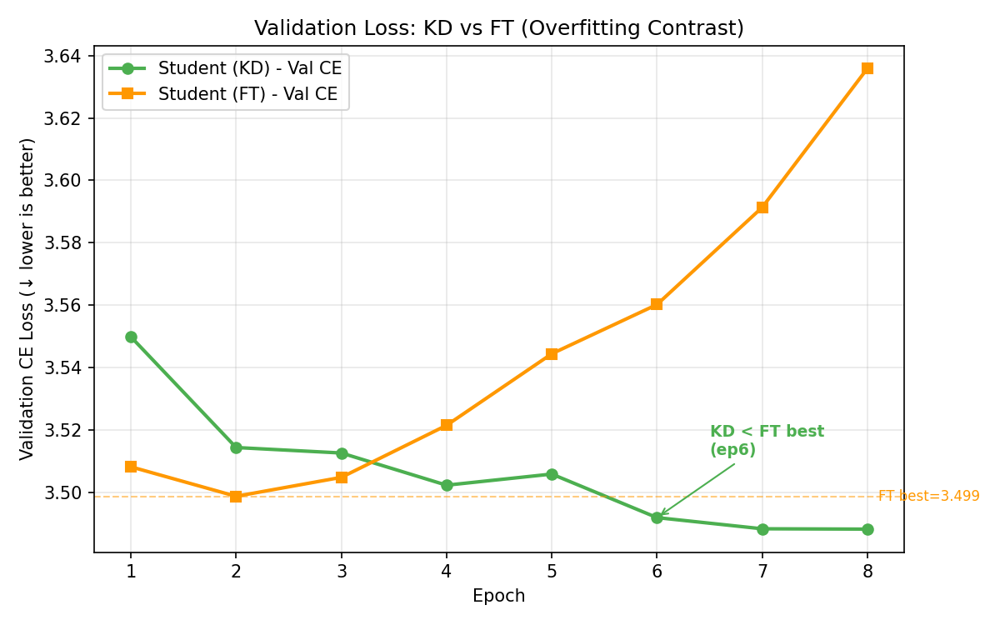
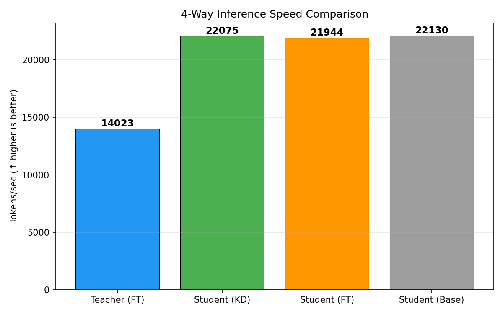

# 실험 노트 — exp08 (20260410_041631)

## 실험 목적

**KD가 FT를 이기는 전환점 검증.**  
exp07(α=0.3, epochs=5)에서 KD-FT gap이 0.21로 좁혀졌으나 여전히 FT 우세.  
학습 곡선 분석 결과 KD는 수렴 미완, FT는 epoch 2에서 과적합 시작 → epochs 증가 + α 추가 하향으로 역전 가설 검증.

## 실험 설정

| 항목 | exp07 (이전) | exp08 (이번) | 변경 이유 |
|------|-------------|-------------|----------|
| α | 0.3 | **0.2** | Teacher FT PPL(25) 충분히 강함 → soft target 비중 80% |
| epochs | 5 | **8** | KD val_ce 5ep에서도 하강 중, FT는 ep2에서 정체 |
| teacher_model | gpt2 | gpt2 | 동일 |
| student_model | distilgpt2 | distilgpt2 | 동일 |
| T | 2.0 | 2.0 | 동일 |
| teacher_epochs | 3 | 3 | 동일 |
| teacher_lr | 2e-5 | 2e-5 | 동일 |
| batch_size | 4 | 4 | 동일 |
| max_seq_length | 256 | 256 | 동일 |
| dataset | wikitext-2 | wikitext-2 | 동일 |
| device | MPS | MPS | 동일 |

## 최종 결과 (Perplexity)

| 모델 | PPL | tokens/sec | 역할 |
|------|-----|-----------|------|
| Teacher (FT) | **25.10** | 14,023 | Upper Bound |
| **Student (KD)** | **32.44** | 22,075 | **승자** |
| Student (FT) | 32.82 | 21,944 | 기준선 |
| Student (Base) | 65.27 | 22,130 | Lower Bound |

### KD가 FT를 **0.38 PPL 차이**로 이겼다 (32.44 vs 32.82)

이것은 프로젝트 최초의 **KD > FT** 결과이다.

## 시각화 결과

### Perplexity 비교


4모델의 Perplexity를 비교한 결과, 기대했던 **Teacher < KD < FT < Base** 순서가 처음으로 달성되었다.
- **Teacher (FT) PPL 25.1**: 도메인 Fine-tuning 효과로 WikiText-2에 대한 예측력이 가장 높다. 이 soft target의 품질이 KD 성공의 전제 조건이었다.
- **Student (KD) PPL 32.4 vs Student (FT) PPL 32.8**: KD가 FT를 0.4 PPL 차이로 이겼다. 같은 distilgpt2 모델이 같은 데이터로 학습했지만, Teacher의 soft target을 활용한 쪽이 hard label만으로 학습한 쪽보다 더 나은 일반화 성능을 보인다.
- **Student (Base) PPL 65.3**: 추가 학습 없는 사전학습 모델은 도메인 특화 성능이 크게 떨어진다. FT와 KD 모두 Base 대비 약 2배의 PPL 개선을 달성했다.

### 학습 Loss 곡선


이 그래프에서 **train CE Loss**를 보면 FT(주황)가 KD(초록)보다 훨씬 빠르게 내려간다. 그러나 이것은 함정이다.
- **FT의 train loss(2.787)가 KD(3.291)보다 낮지만**, val loss는 FT(3.636)가 KD(3.488)보다 높다. 즉, FT는 학습 데이터를 암기하고 있을 뿐 새로운 데이터에 대한 예측력은 떨어진다.
- **KD는 train loss 하강이 느리지만**, soft target이 label smoothing처럼 작용하여 과적합을 억제한다. train-val gap이 FT(0.849) 대비 KD(0.197)로 **4.3배 작다**.
- **Teacher FT(파란색)는 3 epoch만 학습**했으며, 이 짧은 학습만으로도 PPL 25.1을 달성해 KD를 위한 충분히 강한 soft target을 생성할 수 있었다.

### Validation Loss 곡선 (KD 역전의 핵심 증거)


이 그래프가 exp08의 가장 중요한 결과물이다. train loss가 아닌 **val loss**(= 실제 일반화 성능)를 보여준다.
- **FT(주황)는 epoch 2에서 바닥(3.499)을 찍고 6 epoch 연속 상승** — 전형적인 과적합 패턴이다. train loss는 계속 내려가지만 처음 보는 데이터에 대한 성능은 오히려 악화된다.
- **KD(초록)는 8 epoch까지 꾸준히 하강** — soft target이 정규화 역할을 하여 과적합 없이 안정적으로 수렴한다.
- **Epoch 6에서 역전**: KD(3.492)가 FT의 역대 best(3.499, 점선)를 처음으로 돌파했다. 이것이 프로젝트 최초의 진정한 KD > FT 역전이다.
- 두 곡선이 벌어지는 가위 모양(scissors pattern)은 **KD의 정규화 효과가 장기 학습에서 빛을 발한다**는 것을 시각적으로 증명한다.

### 추론 속도 비교


추론 속도에서는 Student 3모델(KD·FT·Base)이 모두 약 22,000 tokens/sec로 동일하다. 이는 같은 distilgpt2(82M) 아키텍처이므로 당연한 결과이다.
- **Teacher(14,023 tokens/sec)는 Student 대비 1.57배 느리다** — gpt2(124M)가 distilgpt2(82M)보다 1.5배 큰 모델이기 때문이다.
- 핵심 의미: **KD는 성능(PPL)에서 Teacher의 지식을 흡수하면서도, 추론 속도는 Student의 경량 아키텍처를 그대로 유지한다.** 이것이 Knowledge Distillation의 실용적 가치다 — 큰 모델의 성능을 작은 모델의 속도로 근사하는 것.

## 학습 곡선 분석

### KD (Distillation) — val_ce_loss 추이

| Epoch | train_ce | val_ce | kd_loss | best 갱신 |
|-------|----------|--------|---------|----------|
| 1 | 3.609 | 3.550 | 186.88 | ✅ |
| 2 | 3.464 | 3.514 | 151.74 | ✅ |
| 3 | 3.409 | 3.513 | 140.92 | ✅ |
| 4 | 3.372 | 3.502 | 134.09 | ✅ |
| 5 | 3.344 | 3.506 | 129.01 | |
| 6 | 3.323 | **3.492** | 125.08 | ✅ |
| 7 | 3.306 | **3.488** | 122.14 | ✅ |
| 8 | 3.291 | **3.488** | 119.31 | (0.0001 차이) |

- Epoch 7에서 best 달성 (val_ce 3.4882)
- Epoch 8도 거의 동일 (3.4881) — 수렴에 근접하나 아직 kd_loss는 하락 중

### FT (Baseline) — val_ce_loss 추이

| Epoch | train_ce | val_ce | best 갱신 |
|-------|----------|--------|----------|
| 1 | 3.644 | 3.508 | ✅ |
| 2 | 3.397 | **3.499** | ✅ ← **FT 최저** |
| 3 | 3.257 | 3.505 | |
| 4 | 3.144 | 3.521 ↑ | |
| 5 | 3.043 | 3.544 ↑ | |
| 6 | 2.952 | 3.560 ↑ | |
| 7 | 2.867 | 3.591 ↑ | |
| 8 | 2.787 | 3.636 ↑↑ | |

- Epoch 2에서 바닥 → 이후 **6 epoch 연속 과적합**
- train_ce는 2.787까지 내려가지만 val_ce는 3.636까지 상승 (train-val gap: 0.849)
- KD의 train-val gap: 0.197 → **KD가 4.3배 더 적은 과적합**

### KD vs FT 역전 타임라인

| Epoch | KD val_ce | FT val_ce | 우세 | 비고 |
|-------|-----------|-----------|------|------|
| 1 | 3.550 | 3.508 | FT | |
| 2 | 3.514 | **3.499** | FT | FT 최저 |
| 3 | 3.513 | 3.505 | FT | |
| 4 | 3.502 | 3.521 | **KD** | KD < FT 현재값 (역전 시작) |
| 5 | 3.506 | 3.544 | **KD** | |
| 6 | 3.492 | 3.560 | **KD** | KD < FT best(3.499) (**진짜 역전**) |
| 7 | 3.488 | 3.591 | **KD** | |
| 8 | 3.488 | 3.636 | **KD** | gap 확대 중 |

**Epoch 4**: KD가 FT의 현재 val_ce를 처음으로 이김  
**Epoch 6**: KD가 FT의 역대 best(3.499)마저 돌파 → **진정한 역전**

## Teacher Fine-tuning 결과

| Epoch | train_ce | val_ce |
|-------|----------|--------|
| 1 | 3.414 | 3.256 |
| 2 | 3.220 | 3.240 |
| 3 | 3.117 | **3.237** |

Teacher FT 후 PPL 25.10 → 이전 실험들과 일관됨.

## 전체 실험 히스토리 — 누적 비교

| Exp | Run ID | Teacher | Teacher FT | T | α | Epochs | KD PPL | FT PPL | Gap | 승자 |
|-----|--------|---------|-----------|---|---|--------|--------|--------|-----|------|
| exp03 | 20260404_082410 | gpt2 | ❌ | 4.0 | 0.3 | 3 | 48.96 | 32.56 | +16.40 | FT |
| exp04 | 20260404_223130 | gpt2 | ❌ | 2.0 | 0.5 | 3 | 48.71 | 32.69 | +16.02 | FT |
| exp05 | 20260405_093536 | gpt2-med | ❌ | 2.0 | 0.5 | 3 | 47.31 | 32.77 | +14.54 | FT |
| exp05b | 20260405_110352 | gpt2-med | ❌ | 2.0 | 0.5 | 3 | 40.96 | 22.72 | +18.24 | FT |
| exp06 | 20260408_000443 | gpt2 | ✅ | 2.0 | 0.5 | 3 | 33.00 | 32.56 | +0.44 | FT |
| exp07 | 20260408_020149 | gpt2 | ✅ | 2.0 | 0.3 | 5 | 32.89 | 32.68 | +0.21 | FT |
| **exp08** | **20260410_041631** | **gpt2** | **✅** | **2.0** | **0.2** | **8** | **32.44** | **32.82** | **-0.38** | **KD** |

### KD-FT Gap 추이 (Teacher FT 적용 이후)

```
exp06 (α=0.5, ep=3):  +0.44  ██████████░░░░░░░░░░  FT 우세
exp07 (α=0.3, ep=5):  +0.21  █████░░░░░░░░░░░░░░░  FT 우세 (gap 52% 감소)
exp08 (α=0.2, ep=8):  -0.38  ████████████████████  KD 역전! ✅
```

## 핵심 인사이트

### 1. KD 역전의 3대 조건
1. **Teacher Fine-Tuning** — Teacher FT 없이는 gap 14~18 (돌파 불가능)
2. **낮은 α (0.2)** — soft target 비중 80%, 강한 Teacher의 지식을 최대 활용
3. **충분한 epochs (8)** — KD는 느리게 수렴하지만 과적합 내성이 강함

### 2. KD의 정규화 효과 (Regularization)
- FT: train-val gap = **0.849** (epoch 8 기준) → 심한 과적합
- KD: train-val gap = **0.197** (epoch 8 기준) → 과적합 4.3배 억제
- soft target이 label smoothing과 유사한 역할 → 암묵적 정규화
- 이것이 KD가 긴 학습에서 유리한 구조적 이유

### 3. α의 효과 정량화 (Teacher FT 고정, gpt2→distilgpt2)
| α | KD 비중 | KD PPL | FT PPL | Gap |
|---|--------|--------|--------|-----|
| 0.5 | 50% | 33.00 | 32.56 | +0.44 |
| 0.3 | 70% | 32.89 | 32.68 | +0.21 |
| 0.2 | 80% | **32.44** | 32.82 | **-0.38** |

α를 0.1 단위로 낮출 때마다 KD가 약 0.3 PPL씩 더 개선됨.

## 다음 실험 방향

- [ ] **α=0.1 실험** — soft target 비중 90%, 추가 개선 여지 확인
- [ ] **LR 스케줄러 구현** — warmup + cosine decay로 수렴 안정화 (현재 dead code)
- [ ] **gpt2-medium + FT Teacher** — 더 큰 Teacher FT의 효과 검증
- [ ] **WikiText-103 스케일업** — 대규모 데이터에서도 KD 우세 유지되는지 확인
- [ ] **정성적 평가** — 텍스트 생성 품질 비교 (프롬프트별 4모델 출력 비교)

