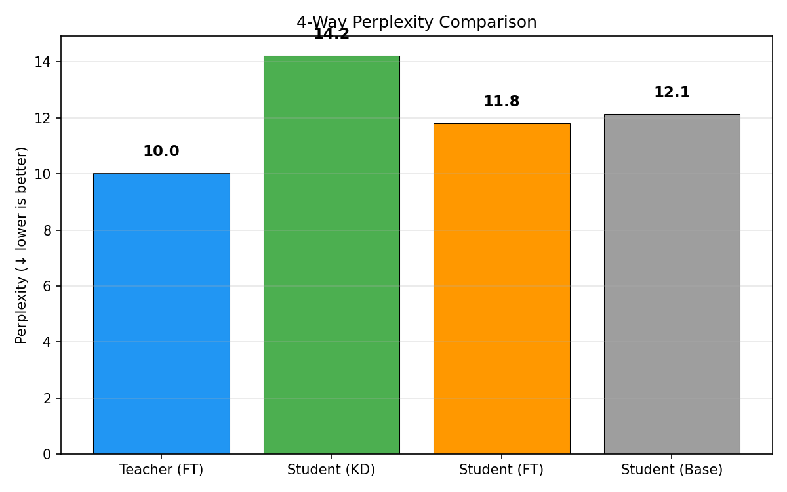
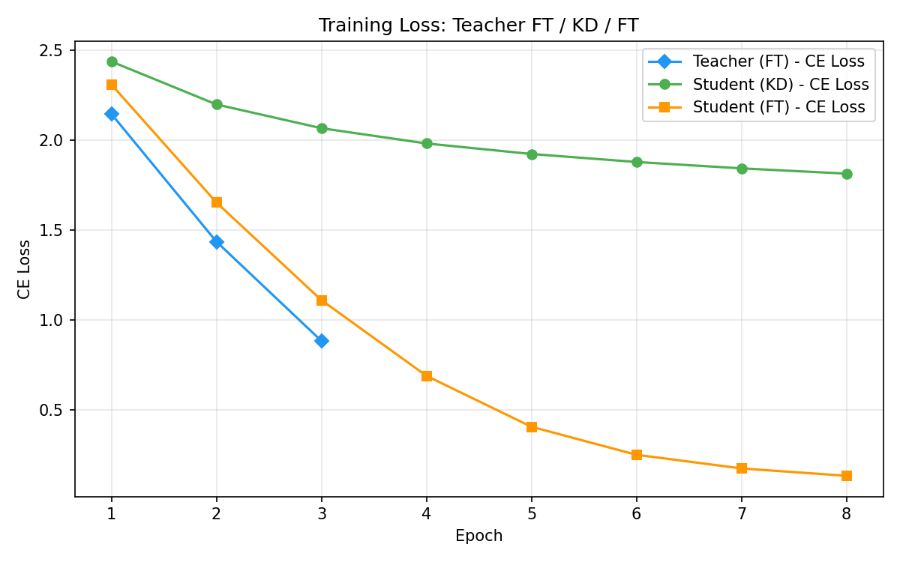
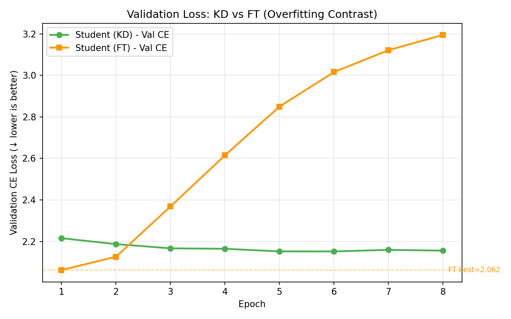
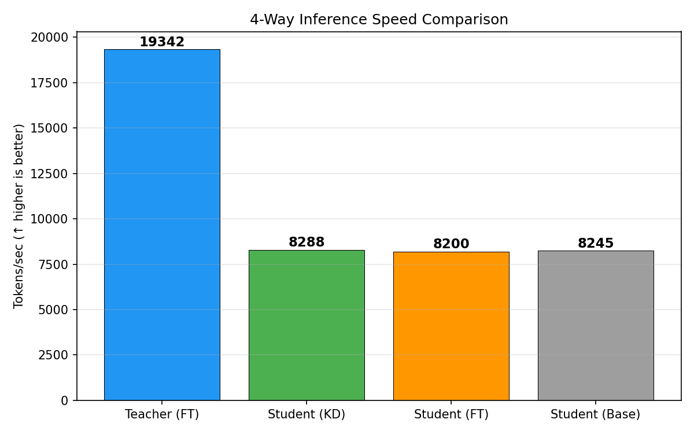

# 실험 노트 — H100 Qwen 3B → 1.5B 한국어 4-Way (20260823_080109)

## 실험 목적

로컬 exp08의 `Teacher FT → Student KD / Student FT → 4-Way 평가` 구조를
한국어 Wikipedia와 B급 Qwen 모델에 적용했다. KD가 동일 조건의 CE-only
fine-tuning보다 일반화 성능을 높이는지 검증한다.

## 실험 설정

| 항목 | 값 |
|---|---|
| Teacher / Student | Qwen2.5-3B / Qwen2.5-1.5B |
| 데이터 | `wikimedia/wikipedia`, `20231101.ko` |
| 문서 / split | 1,000 / 90:5:5, seed 42 |
| sequence / batch | 256 / 2 |
| Teacher FT | 3 epochs, lr 2e-5 |
| Student KD / FT | 8 epochs, lr 2e-5 |
| temperature / alpha | 2.0 / 0.2 |
| 장치 / 정밀도 | Azure H100 NVL / BF16 |
| 총 wall-clock | 43분 7초 |

## 최종 결과

| 모델 | PPL | 역할 |
|---|---:|---|
| Teacher (FT) | **10.02** | Upper bound |
| Student (KD) | 14.23 | 증류 모델 |
| Student (FT) | **11.80** | Student 최우수 |
| Student (Base) | 12.13 | 추가 학습 없는 기준선 |

KD는 FT보다 PPL이 2.43 높았고 약 20.6% 열세였다. 또한 Base보다도 PPL이
2.10 높아 이번 설정에서는 증류 효과를 확인하지 못했다. Teacher와 Base
Student의 원래 PPL 차이가 2.10에 불과해 2배 크기의 Teacher가 전달할 추가
지식이 제한적이었다.

## 시각화

### Perplexity

### Training Loss

### Validation Loss

### Inference Speed

> 이 run의 Student 평가 모델은 FP32, Teacher는 BF16으로 로드된 코드 결함이
> 있었다. PPL 해석은 유지하지만 추론 속도와 메모리 수치는 정밀도가 달라 직접
> 비교하지 않는다. 이후 run부터 모든 모델을 BF16으로 통일했다.

## 학습 곡선 해석

### Teacher FT

| Epoch | train CE | val CE |
|---:|---:|---:|
| 1 | 2.146 | **1.934** |
| 2 | 1.436 | 2.019 |
| 3 | 0.885 | 2.266 |

Teacher는 epoch 1에서 validation 최저점을 기록했고 이후 과적합했다. 저장된
best checkpoint는 epoch 1이다.

### Student KD

| Epoch | train CE | val CE | KD loss |
|---:|---:|---:|---:|
| 1 | 2.438 | 2.215 | 401.61 |
| 2 | 2.199 | 2.187 | 282.00 |
| 3 | 2.067 | 2.167 | 244.24 |
| 4 | 1.982 | 2.164 | 221.96 |
| 5 | 1.924 | **2.152** | 207.76 |
| 6 | 1.879 | **2.152** | 196.78 |
| 7 | 1.844 | 2.159 | 188.16 |
| 8 | 1.815 | 2.156 | 181.08 |

KD validation CE는 epoch 5~6에서 수렴했으며 과적합은 작았다. 그러나 Teacher와
Student의 초기 성능 차이가 작아 FT보다 나은 test PPL로 이어지지 않았다.

### Student FT

| Epoch | train CE | val CE |
|---:|---:|---:|
| 1 | 2.309 | **2.062** |
| 2 | 1.654 | 2.126 |
| 3 | 1.111 | 2.369 |
| 4 | 0.691 | 2.615 |
| 5 | 0.407 | 2.850 |
| 6 | 0.252 | 3.016 |
| 7 | 0.176 | 3.122 |
| 8 | 0.135 | 3.195 |

FT는 epoch 1 이후 과적합했지만 best checkpoint 기준 test PPL은 11.80으로 가장
좋았다. 이는 반드시 best-checkpoint selection을 유지해야 함을 보여준다.

## 결론과 다음 실험

- Qwen 3B → 1.5B는 압축비가 2배로 작아 KD 이득이 제한적이었다.
- 다음 실험은 동일 조건에서 `Qwen2.5-7B → Qwen2.5-1.5B`로 Teacher 격차를 키운다.
- 7B와 1.5B tokenizer vocabulary는 동일하지만 output head padding이 달라 실제
	tokenizer vocabulary 구간만 KL 비교하도록 코드를 수정했다.
- Spot VM의 `/mnt`는 eviction 시 초기화되므로 영구 checkpoint 보존 전략이 필요하다.

