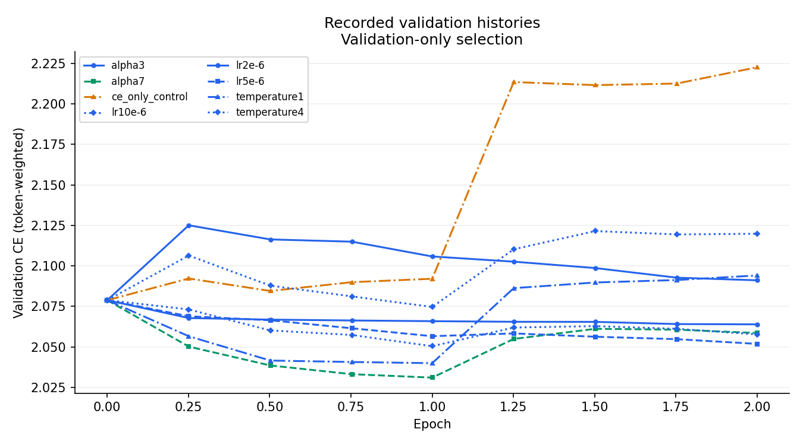
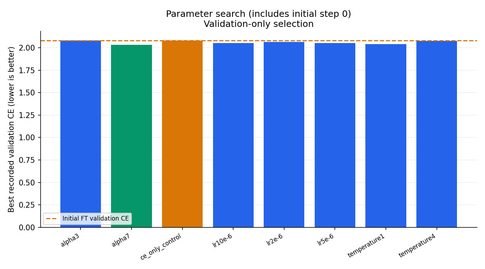
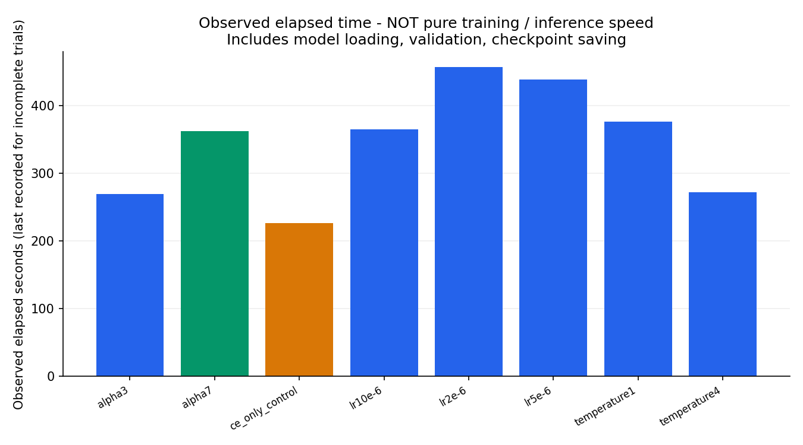
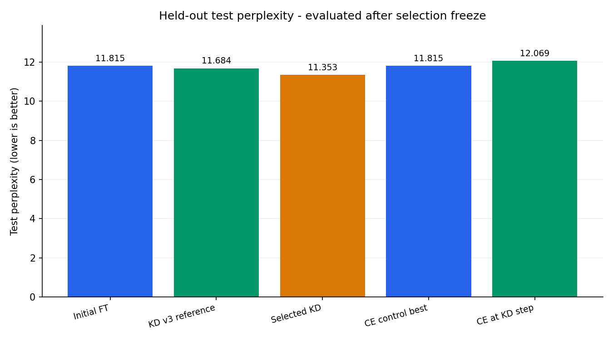

# H100 tuning report: h100-tuning-20260920

**Status: completed**; completed: true.

Final test metrics are available; candidate selection was frozen using validation only.

## Current parameters and validation

Frozen winner: **alpha7**.

learning_rate=1e-05, alpha=0.7, temperature=2.

Best validation CE: 2.03106; step: 765; epoch: 1.

| Trial | Status | LR | Alpha | Temperature | Best validation CE | Best step | Elapsed s | Peak GiB |
|---|---|---:|---:|---:|---:|---:|---:|---:|
| alpha3 | completed | 1e-05 | 0.3 | 2 | 2.07883 | 0 | 269.065 | 23.6746 |
| alpha7 | completed | 1e-05 | 0.7 | 2 | 2.03106 | 765 | 362.237 | 23.6746 |
| ce_only_control | completed | 1e-05 | 1 | 2 | 2.07883 | 0 | 226.198 | 9.44725 |
| lr10e-6 | completed | 1e-05 | 0.5 | 2 | 2.05044 | 765 | 364.845 | 23.6746 |
| lr2e-6 | completed | 2e-06 | 0.5 | 2 | 2.06392 | 1530 | 457.151 | 23.6746 |
| lr5e-6 | completed | 5e-06 | 0.5 | 2 | 2.05187 | 1530 | 439.159 | 23.6746 |
| temperature1 | completed | 1e-05 | 0.7 | 1 | 2.03997 | 765 | 376.194 | 23.6746 |
| temperature4 | completed | 1e-05 | 0.7 | 4 | 2.07466 | 765 | 272.275 | 23.6746 |

## Held-out test

| Model | Test CE | Test perplexity | Tokens |
|---|---:|---:|---:|
| student_ft_initial | 2.46936 | 11.8149 | 35955 |
| student_kd_v3_reference | 2.45819 | 11.6836 | 35955 |
| student_kd_selected | 2.42949 | 11.3531 | 35955 |
| student_ce_control_best | 2.46936 | 11.8149 | 35955 |
| student_ce_at_kd_step | 2.49061 | 12.0686 | 35955 |

## Evidence and figures

- [alpha.json](alpha.json)
- [initial_validation.json](initial_validation.json)
- [lr.json](lr.json)
- [manifest.json](manifest.json)
- [plans/alpha3.json](plans/alpha3.json)
- [plans/alpha7.json](plans/alpha7.json)
- [plans/ce_only_control.json](plans/ce_only_control.json)
- [plans/lr10e-6.json](plans/lr10e-6.json)
- [plans/lr2e-6.json](plans/lr2e-6.json)
- [plans/lr5e-6.json](plans/lr5e-6.json)
- [plans/temperature1.json](plans/temperature1.json)
- [plans/temperature4.json](plans/temperature4.json)
- [selection.json](selection.json)
- [temperature.json](temperature.json)
- [test_results.json](test_results.json)
- [trials/alpha3/config.json](trials/alpha3/config.json)
- [trials/alpha3/result.json](trials/alpha3/result.json)
- [trials/alpha3/validation_history.json](trials/alpha3/validation_history.json)
- [trials/alpha7/config.json](trials/alpha7/config.json)
- [trials/alpha7/result.json](trials/alpha7/result.json)
- [trials/alpha7/validation_history.json](trials/alpha7/validation_history.json)
- [trials/ce_only_control/config.json](trials/ce_only_control/config.json)
- [trials/ce_only_control/result.json](trials/ce_only_control/result.json)
- [trials/ce_only_control/validation_history.json](trials/ce_only_control/validation_history.json)
- [trials/lr10e-6/config.json](trials/lr10e-6/config.json)
- [trials/lr10e-6/result.json](trials/lr10e-6/result.json)
- [trials/lr10e-6/validation_history.json](trials/lr10e-6/validation_history.json)
- [trials/lr2e-6/config.json](trials/lr2e-6/config.json)
- [trials/lr2e-6/result.json](trials/lr2e-6/result.json)
- [trials/lr2e-6/validation_history.json](trials/lr2e-6/validation_history.json)
- [trials/lr5e-6/config.json](trials/lr5e-6/config.json)
- [trials/lr5e-6/result.json](trials/lr5e-6/result.json)
- [trials/lr5e-6/validation_history.json](trials/lr5e-6/validation_history.json)
- [trials/temperature1/config.json](trials/temperature1/config.json)
- [trials/temperature1/result.json](trials/temperature1/result.json)
- [trials/temperature1/validation_history.json](trials/temperature1/validation_history.json)
- [trials/temperature4/config.json](trials/temperature4/config.json)
- [trials/temperature4/result.json](trials/temperature4/result.json)
- [trials/temperature4/validation_history.json](trials/temperature4/validation_history.json)









## Measurement limitations

- Selection uses validation only; test is never used to rank candidates.
- Validation CE is token-weighted FP32 next-token cross-entropy, not training loss.
- Training loss and inference speed were not measured in these artifacts; no train-loss or inference-speed figures are generated.
- Observed elapsed time includes model loading, validation, and checkpoint saving; it is not pure training time or inference speed. Incomplete trials show only the last recorded elapsed time, not a live duration.
- Single training seed and small Wikipedia holdout: not a general capability benchmark.
- Artifact status does not prove a training process is currently alive.
- Single training seed, small Wikipedia holdout; not a general capability benchmark.

## Reproducibility

Training seed: 42.

Frozen configuration, split counts/hashes, and versions (when available):

```json
{
  "base_config": {
    "teacher_model": "Qwen/Qwen2.5-7B",
    "student_model": "Qwen/Qwen2.5-1.5B",
    "dataset_name": "wikimedia/wikipedia",
    "dataset_config": "20231101.ko",
    "dataset_revision": "b04c8d1ceb2f5cd4588862100d08de323dccfbaa",
    "dataset_text_column": "text",
    "dataset_streaming": true,
    "dataset_max_samples": 1000,
    "dataset_shuffle_buffer": 10000,
    "validation_ratio": 0.05,
    "test_ratio": 0.05,
    "max_seq_length": 256,
    "temperature": 2.0,
    "alpha": 0.5,
    "kd_vocab_size": 0,
    "kd_reduction": "tokenmean",
    "kd_divergence": "reverse_kl",
    "teacher_epochs": 3,
    "teacher_learning_rate": 2e-05,
    "teacher_checkpoint": "/var/lib/kd-results/qwen7b-4way/checkpoints/qwen7b-korean-4way-v1/teacher_ft_best_adapter",
    "teacher_lora_rank": 16,
    "teacher_lora_alpha": 32,
    "teacher_lora_dropout": 0.05,
    "teacher_lora_target_modules": [
      "q_proj",
      "k_proj",
      "v_proj",
      "o_proj"
    ],
    "epochs": 2,
    "batch_size": 2,
    "max_train_steps": 0,
    "max_eval_steps": 0,
    "learning_rate": 1e-05,
    "weight_decay": 0.01,
    "warmup_steps": 100,
    "gradient_clip": 1.0,
    "optimizer": "adafactor",
    "gradient_checkpointing": false,
    "distill_student_checkpoint": "/var/lib/kd-results/qwen7b-4way/checkpoints/qwen7b-korean-4way-v1/student_ft_best.pt",
    "early_stopping_patience": 0,
    "early_stopping_min_delta": 0.0,
    "output_dir": "/var/lib/kd-results/h100-tuning-20260920",
    "run_id": "validation-sweep",
    "device": "cuda:0",
    "teacher_device": "cuda:0",
    "seed": 42,
    "num_workers": 4,
    "fp16": false,
    "bf16": true
  },
  "training_seed": 42,
  "validation_checks_per_epoch": 4,
  "selection_metric": "validation token-weighted FP32 CE",
  "vocabulary_size": 151665,
  "splits": {
    "train": {
      "blocks": 1529,
      "input_ids_sha256": "3bb106601baff2434d26ab8370afd04ec5ad697db08aa1b044f072449e418a8f"
    },
    "validation": {
      "blocks": 87,
      "input_ids_sha256": "590feca74414013ccb5def68a08e980c5192af011329093b115328cc4dae4c4a"
    },
    "test": {
      "blocks": 141,
      "input_ids_sha256": "b6571dfb62fe35abd0984c84397a609aadfd9b9d85343a2768a908a7ad4e9de4"
    }
  },
  "initial_ft_sha256": "23a07d381f66e5af736d21a15a2455ae9e200a08ad4813ed9b8f79980cde611d",
  "teacher_adapter_sha256": "7caf2ce3a69f7296a0421814aeac1605472123388fc861d31b0a7b2c9cc319f4",
  "versions": {
    "torch": "2.11.0+cu128",
    "transformers": "4.55.4",
    "datasets": "3.6.0",
    "peft": "0.20.0",
    "accelerate": "1.14.0",
    "numpy": "2.5.2"
  },
  "source_sha256": {
    "src/h100_tuning.py": "210112eeded345a63913ccd1e73f3ac36c9773f6f8ef1f2ca457d597cfb41a4e",
    "src/distill.py": "6e91181e2ed595b20a6f7644ffaa863ad157421978df7ee4b4fbb7b4d7dfeb80",
    "scripts/tune_h100.py": "f08802b0ca5eba3583afc277d3fbb668d8fdbd2ad5684e97ec3aed8f19cb7d5a"
  },
  "gpu": "NVIDIA H100 NVL",
  "note": "Old H100 training RNG was not fixed; this is a new controlled comparison."
}
```

User notes are preserved in [notes.md](notes.md).
