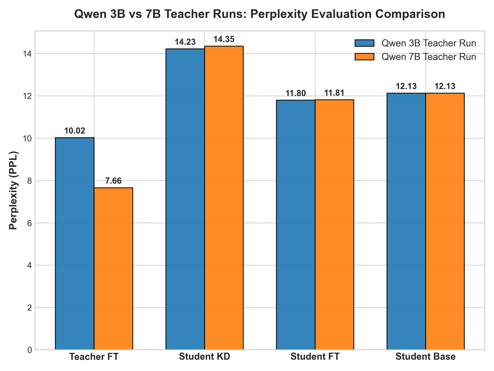
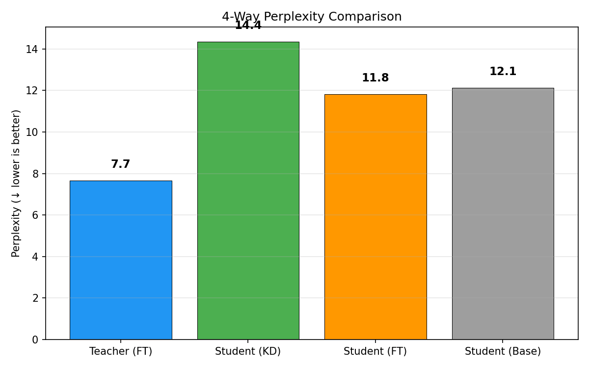
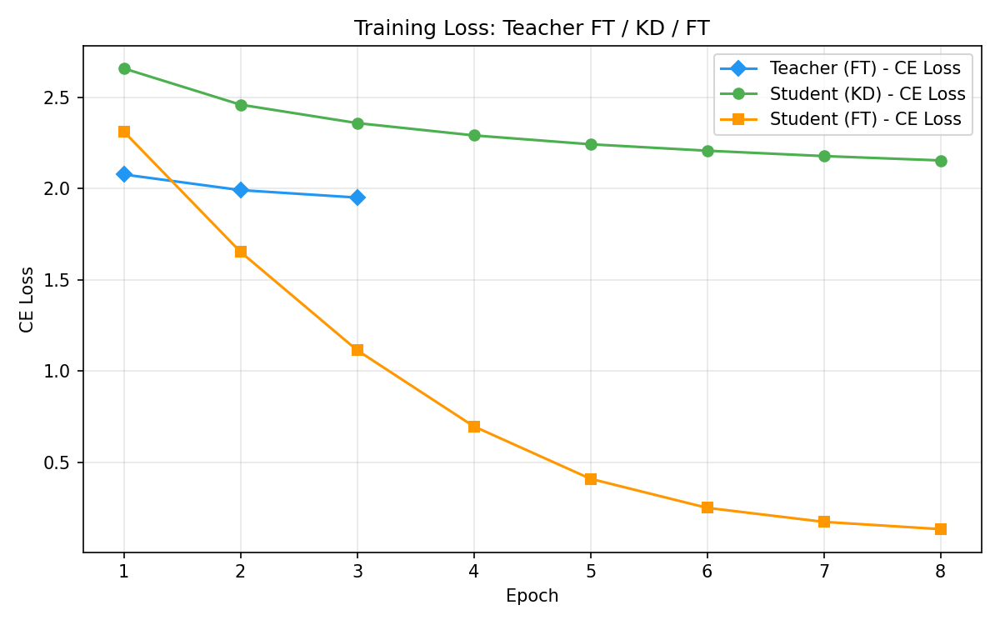
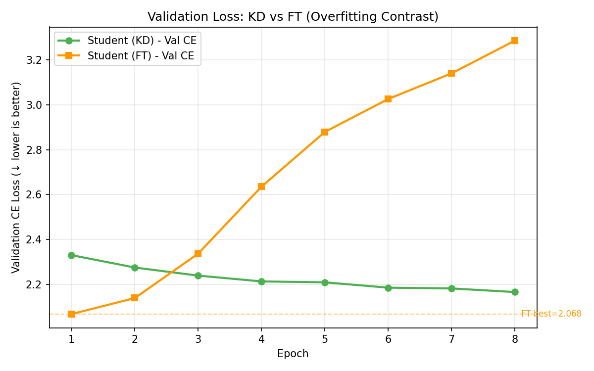
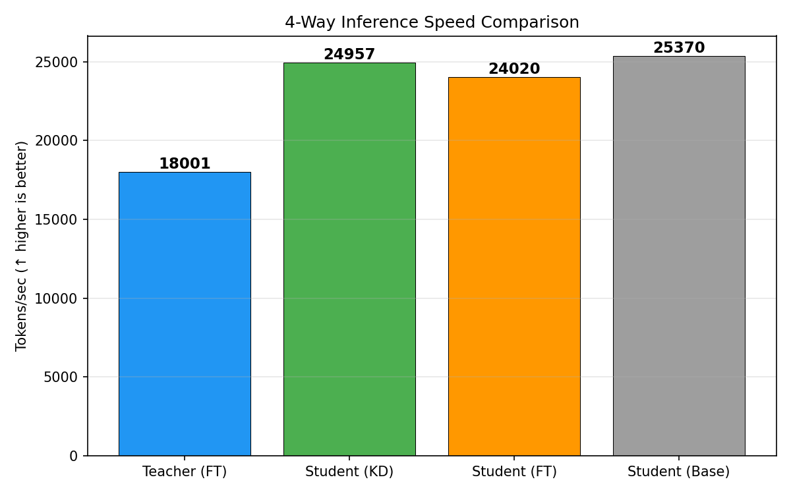

# 실험 노트 — Qwen 7B → 1.5B 한국어 4-Way

Run ID: `qwen7b-korean-4way-v1`

## 실험 목적

Qwen 3B → 1.5B 실험에서 Teacher와 Base Student의 PPL 차이가 2.10에 불과했고
KD가 FT보다 나빴다. Teacher를 7B로 키워 압축비와 성능 차이를 확대하면 동일한
Student가 더 유용한 soft target을 학습할 수 있는지 검증한다.

로컬 exp08과 동일하게 Teacher FT, Student KD, 동일 조건 Student FT, Base를
4-Way로 비교한다. Azure H100 Spot 회수에 대비해 Teacher는 LoRA로 학습하고
adapter와 Student checkpoint를 영구 OS 디스크에 저장했다.

## 실험 설정

| 항목 | 값 |
|---|---|
| Teacher / Student | Qwen2.5-7B / Qwen2.5-1.5B |
| 파라미터 압축비 | 7.62B → 1.54B, **4.93배** |
| Teacher 학습 | LoRA rank 16, alpha 32, dropout 0.05 |
| LoRA target | `q_proj`, `k_proj`, `v_proj`, `o_proj` |
| 데이터 | `wikimedia/wikipedia`, `20231101.ko` |
| revision | `b04c8d1ceb2f5cd4588862100d08de323dccfbaa` |
| 표본 / split | 1,000문서 / 90:5:5, seed 42 |
| sequence length / batch | 256 / 2 |
| Teacher FT | 3 epochs, lr 2e-5 |
| Student KD / FT | 8 epochs, lr 2e-5 |
| temperature / alpha | 2.0 / 0.2 (KD 비중 80%) |
| optimizer | Adafactor, weight decay 0.01 |
| 장치 / 정밀도 | Azure H100 NVL 94GB / BF16 |

7B와 1.5B는 tokenizer vocabulary가 동일하지만 output head 크기는 각각
152,064와 151,936이다. KL loss는 실제 tokenizer vocabulary 151,665개 구간만
사용해 padding row를 제외했다.

## 최종 결과

| 모델 | 파라미터 | PPL | tokens/sec | 역할 |
|---|---:|---:|---:|---|
| Teacher (FT) | 7.62B | **7.66** | 18,001 | Upper bound |
| Student (KD) | 1.54B | 14.35 | 24,957 | 증류 모델 |
| Student (FT) | 1.54B | **11.81** | 24,020 | Student 최우수 |
| Student (Base) | 1.54B | 12.13 | 25,370 | 추가 학습 없는 기준선 |

### 핵심 판정

- KD는 FT보다 PPL이 **2.54 높아 21.5% 열세**다.
- KD는 Base보다도 PPL이 **2.23 높아 18.4% 열세**다.
- Teacher는 Base Student보다 PPL이 4.47 낮아 충분히 강해졌지만, 현재 KD loss가
	그 성능 차이를 Student 개선으로 전달하지 못했다.
- Student는 Teacher보다 약 1.39배 빠르고 파라미터는 약 1/4.93이므로 배포
	효율성 목표는 충족한다.

## 3B Teacher 실험과 비교

| 모델 | 3B Teacher run | 7B Teacher run | 변화 |
|---|---:|---:|---:|
| Teacher (FT) | 10.02 | **7.66** | **-23.6%** |
| Student (KD) | **14.23** | 14.35 | +0.9% |
| Student (FT) | 11.80 | 11.81 | +0.1% |
| Student (Base) | 12.13 | 12.13 | 동일 |

Teacher 확장은 Teacher 자체 성능만 크게 개선했고 Student KD에는 전달되지 않았다.
이 결과는 압축비 부족이 유일한 원인이 아니며, 큰 Teacher와 작은 Student 사이의
분포 격차에 맞는 temperature, KL 방향 또는 loss normalization이 필요함을 뜻한다.

## 시각화

### Perplexity 비교

### 학습 Loss

### Validation Loss

### 추론 속도

모든 모델을 BF16으로 평가했으므로 7B run 내부 속도 비교는 유효하다.

## 학습 곡선

### Teacher LoRA FT

| Epoch | train CE | val CE | 시간 |
|---:|---:|---:|---:|
| 1 | 2.077 | 1.794 | 97초 |
| 2 | 1.991 | 1.775 | 94초 |
| 3 | 1.950 | **1.768** | 94초 |

Teacher는 3 epoch 동안 validation loss가 계속 감소했다. 3B full FT가 epoch 1부터
과적합한 것과 달리 LoRA가 규제 역할을 했고, 39MB adapter만으로 PPL 7.66을
달성했다.

### Student KD

| Epoch | train CE | val CE | KD loss | 시간 |
|---:|---:|---:|---:|---:|
| 1 | 2.657 | 2.331 | 431.56 | 133초 |
| 2 | 2.459 | 2.275 | 315.57 | 130초 |
| 3 | 2.358 | 2.240 | 280.66 | 129초 |
| 4 | 2.291 | 2.214 | 259.78 | 130초 |
| 5 | 2.242 | 2.210 | 245.06 | 130초 |
| 6 | 2.207 | 2.186 | 233.73 | 129초 |
| 7 | 2.177 | 2.182 | 224.57 | 129초 |
| 8 | 2.154 | **2.166** | 217.21 | 130초 |

KD validation CE는 8 epoch까지 계속 개선됐고 최종 train-val 차이는 0.013으로
과적합이 거의 없다. 다만 test PPL은 Base/FT보다 나빠, 현재 목적함수가 Teacher
분포를 따라가면서도 정답 예측 일반화는 충분히 높이지 못했다.

### Student FT

| Epoch | train CE | val CE | 시간 |
|---:|---:|---:|---:|
| 1 | 2.311 | **2.068** | 112초 |
| 2 | 1.653 | 2.140 | 109초 |
| 3 | 1.114 | 2.337 | 109초 |
| 4 | 0.698 | 2.636 | 109초 |
| 5 | 0.411 | 2.879 | 108초 |
| 6 | 0.252 | 3.025 | 109초 |
| 7 | 0.175 | 3.139 | 109초 |
| 8 | 0.135 | 3.285 | 109초 |

FT는 epoch 1 이후 명확하게 과적합했다. 최종 val-train gap은 3.15지만 best
checkpoint를 epoch 1에서 저장해 test PPL 11.81을 확보했다.

## 수행 시간과 산출물

- Teacher LoRA FT 누적: **4분 44초**
- Student KD 누적: **17분 19초**
- Student FT 누적: **14분 33초**
- 순수 학습 누적: **약 36분 36초** (다운로드·평가·Spot 중단 제외)
- Teacher adapter: 약 39MB
- Student KD / FT checkpoint: 각각 약 2.9GB

Spot VM이 여러 차례 회수되어 실제 wall-clock 시간은 연속 실행 시간으로 해석하지
않는다. 영구 OS 디스크의 단계별 checkpoint 덕분에 완료된 단계는 재실행하지 않았다.

## 결론 및 다음 실험

1. 7B Teacher는 충분히 강하고 LoRA도 안정적이다.
2. 문제는 Teacher 크기가 아니라 현재 Forward-KL 증류 설정이다.
3. 우선 `temperature=4`를 시험해 Teacher 분포를 더 부드럽게 만든다.
4. `alpha=0.1`도 비교해 hard-label 비중을 낮춘다.
5. 같은 데이터 split과 Student 조건을 유지해 KD 항만 바꿔야 인과 비교가 가능하다.
6. Spot watchdog으로 VM 재기동, 환경 복구, 단계 재개, 결과 회수를 자동화한다.

