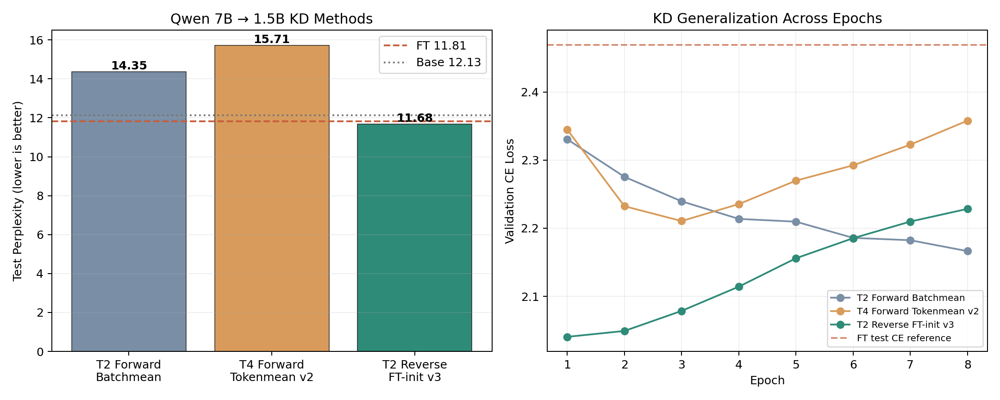
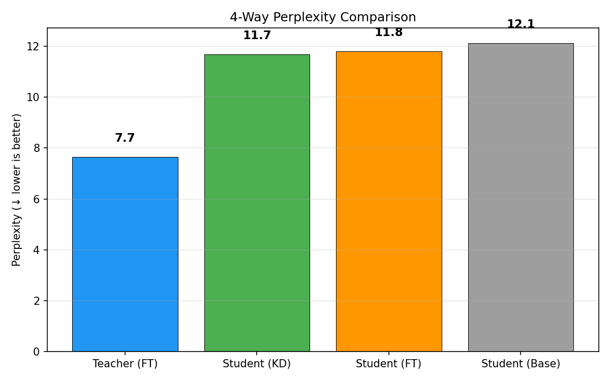
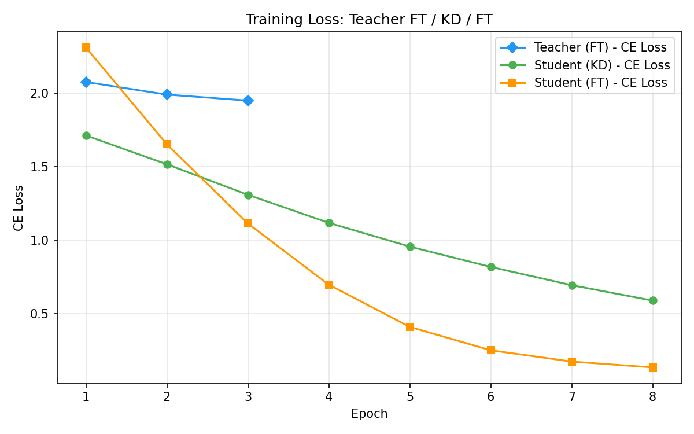
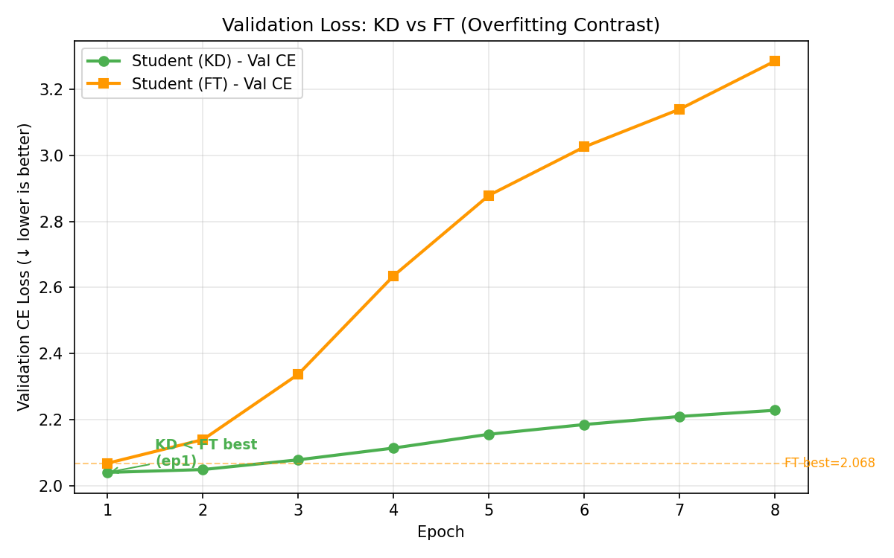
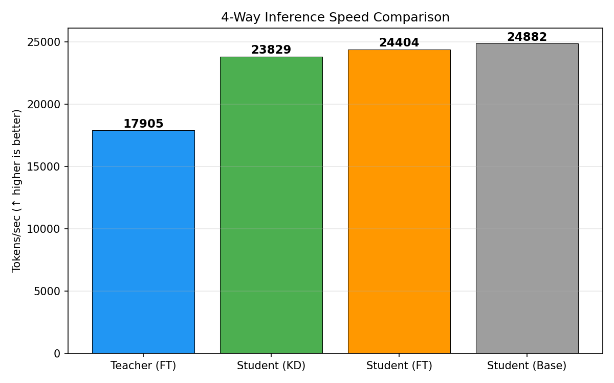

# 실험 노트 — Qwen 7B → 1.5B Reverse-KL v3

Run ID: `qwen7b-korean-reverse-v3`

## 실험 목적과 가설

두 Forward-KL 실험에서 Teacher는 PPL 7.66으로 강했지만 KD Student는 Base보다
나빴다. MiniLLM은 생성 LLM에서 Forward KL이 Teacher의 저확률 tail까지 Student가
덮도록 만들어 부정확한 확률 질량을 과대평가할 수 있다고 지적한다. 또한 공식
MiniLLM 구현은 Base가 아니라 SFT Student를 초기 checkpoint로 사용한다.

v3는 다음 두 요소를 현재 plain-text 파이프라인에 적용했다.

1. 기존 Student FT best checkpoint에서 KD 시작
2. Forward KL 대신 valid-token 평균 Reverse KL 사용

GKD/MiniLLM의 student-generated on-policy 학습은 아직 포함하지 않았다. 따라서
v3는 **off-policy token-level Reverse KL** 실험이다.

## 실험 설정

| 항목 | 값 |
|---|---|
| Teacher / Student | Qwen2.5-7B / Qwen2.5-1.5B |
| 압축비 | **4.93배** |
| Student 초기값 | 기존 CE-only FT best |
| 데이터 | 한국어 Wikipedia 1,000문서, seed 42 |
| split | train 90% / validation 5% / test 5% |
| sequence / batch | 256 / 2 |
| epochs | 8 |
| learning rate | 1e-5 |
| temperature / alpha | 2.0 / 0.5 |
| KD divergence / reduction | Reverse KL / tokenmean |
| optimizer | Adafactor |
| 장치 / 정밀도 | H100 NVL / BF16 |

## 최종 4-Way 결과

| 모델 | PPL | tokens/sec | 역할 |
|---|---:|---:|---|
| Teacher (FT) | **7.66** | 17,905 | Upper bound |
| **Student (KD)** | **11.68** | 23,829 | Student 최우수 |
| Student (FT) | 11.81 | 24,404 | 초기화/대조군 |
| Student (Base) | 12.13 | 24,882 | 원본 기준선 |

- KD는 FT 대비 PPL **0.13 낮음, 1.09% 개선**
- KD는 Base 대비 PPL **0.44 낮음, 3.65% 개선**
- Student는 Teacher보다 1.33배 빠르고 파라미터는 약 1/4.93

이 실험은 B급 Qwen 한국어 설정에서 최초로 `Teacher < KD < FT < Base` 순서를
달성했다.

## 방법별 비교

| 방법 | Student 초기값 | Divergence | KD PPL | FT 대비 |
|---|---|---|---:|---:|
| T2 Forward batchmean | Base | Forward KL | 14.35 | +2.54 |
| T4 Forward tokenmean v2 | Base | Forward KL | 15.71 | +3.90 |
| **T2 Reverse tokenmean v3** | **FT best** | **Reverse KL** | **11.68** | **-0.13** |

v3는 T2 Forward 대비 18.6%, T4 Forward 대비 25.6% 낮은 PPL을 기록했다.
다만 초기화와 divergence, alpha, learning rate를 함께 바꿨으므로 개선을 Reverse KL
하나의 효과로 단정할 수 없다.

## 시각화

## Epoch별 KD 곡선

| Epoch | train CE | val CE | Reverse KL | 선택 |
|---:|---:|---:|---:|---|
| 1 | 1.713 | **2.040** | 2.089 | **최종 best** |
| 2 | 1.517 | 2.049 | 1.681 | |
| 3 | 1.309 | 2.079 | 1.559 | |
| 4 | 1.119 | 2.114 | 1.503 | |
| 5 | 0.957 | 2.156 | 1.473 | |
| 6 | 0.819 | 2.185 | 1.451 | |
| 7 | 0.695 | 2.210 | 1.432 | |
| 8 | 0.590 | 2.228 | 1.413 | |

Validation CE는 epoch 1 이후 계속 악화했다. v3의 성공 checkpoint는 epoch 1이며,
나머지 7 epoch는 과적합 구간이다. 향후에는 early stopping 또는 1~2 epoch 설정이
필요하다.

## 수행 시간과 운영 안정성

- KD 8 epoch 누적: 약 **17분 30초**
- Spot VM 회수 시 자동 재시작, 영구 환경 복구, 단계 재개 수행
- 완료 후 JSON 로그와 차트를 로컬 `results`로 자동 회수
- OS 영구 디스크를 128GB로 확장해 모델 캐시와 checkpoint 보존

## 결론과 다음 검증

1. SFT 초기화 + Reverse KL 조합은 현재 데이터에서 KD 우위를 만들었다.
2. 개선폭은 1.09%로 작으므로 seed 반복으로 통계적 안정성을 확인해야 한다.
3. 인과 분리를 위해 다음 ablation이 필요하다.
	- FT 초기화 + Forward KL
	- Base 초기화 + Reverse KL
	- FT 초기화 + Reverse KL (현재 v3)
4. epoch 1에서 이미 best이므로 early stopping을 구현한다.
5. 실제 실버케어 적용 전에는 Wikipedia PPL 외 한국어 이해·안전·도메인 평가가 필요하다.

