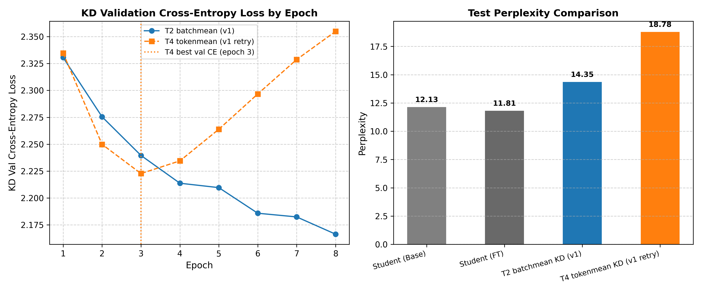

# 실험 노트 — Qwen 7B → 1.5B T4 Tokenmean KD v1

Run ID: `qwen7b-korean-t4-tokenmean-v1`

## 실험 목적

첫 7B 실험에서 `batchmean` KL이 sequence 전체에 합산되어 KD loss가 약
174~346으로 CE보다 약 100배 컸다. Teacher/FT/Base와 데이터 split은 그대로
재사용하고, Student KD 목적함수만 다음처럼 변경해 효과를 분리한다.

- Temperature: 2 → **4**
- KL reduction: `batchmean` → **유효 token 평균 (`tokenmean`)**
- Alpha: 0.2 유지 (CE 20%, KD 80%)
- Teacher LoRA adapter와 Student FT checkpoint 재사용

## 공통 설정

| 항목 | 값 |
|---|---|
| Teacher / Student | Qwen2.5-7B / Qwen2.5-1.5B |
| 데이터 | 한국어 Wikipedia `20231101.ko`, 1,000문서 |
| split / seed | 90:5:5 / 42 |
| sequence / batch | 256 / 2 |
| Student KD | 8 epochs, lr 2e-5, Adafactor |
| temperature / alpha | 4.0 / 0.2 |
| KD reduction | tokenmean |
| 장치 / 정밀도 | H100 NVL / BF16 |

## 최종 결과

| 모델 | PPL | 비고 |
|---|---:|---|
| Teacher (FT) | **7.66** | 기존 adapter 재사용 |
| Student (KD) | **18.78** | epoch 8 checkpoint |
| Student (FT) | 11.81 | 기존 best checkpoint 재사용 |
| Student (Base) | 12.13 | 원본 Student |

KD는 FT보다 PPL이 6.97 높고 Base보다 6.66 높아 크게 악화됐다. 그러나 이 값은
tokenmean의 최선 결과가 아니라 잘못된 checkpoint 선택 기준의 영향을 포함한다.

## 기존 T2 Batchmean과 비교

| 항목 | T2 batchmean | T4 tokenmean v1 |
|---|---:|---:|
| KD loss (final) | 217.21 | **1.01** |
| KD best val CE | **2.166 (ep8)** | 2.223 (ep3) |
| KD final val CE | **2.166** | 2.355 |
| KD test PPL | **14.35** | 18.78 |
| 학습 시간 | 17분 19초 | 17분 40초 |

Tokenmean은 sequence length에 비례하던 KL 크기를 CE와 같은 수치 범위로
정규화하는 데 성공했다. 반면 temperature 4와 KD 비중 80% 조합은 epoch 3 이후
CE 일반화를 악화시켰다.

## Epoch별 KD 곡선

| Epoch | train CE | val CE | KD loss | val total |
|---:|---:|---:|---:|---:|
| 1 | 2.743 | 2.335 | 1.588 | 1.502 |
| 2 | 2.159 | 2.250 | 1.218 | 1.396 |
| 3 | 1.766 | **2.223** | 1.141 | 1.350 |
| 4 | 1.444 | 2.234 | 1.100 | 1.327 |
| 5 | 1.174 | 2.264 | 1.071 | 1.311 |
| 6 | 0.947 | 2.297 | 1.047 | 1.302 |
| 7 | 0.756 | 2.329 | 1.026 | 1.296 |
| 8 | 0.595 | 2.355 | **1.007** | **1.286** |

Validation CE는 epoch 3이 최저였지만 validation total loss는 epoch 8까지 계속
하락했다. 기존 코드는 `val_total_loss`를 best 기준으로 사용해 epoch 8을 저장했다.
최종 평가 PPL은 CE 기반이므로 이 선택 기준이 평가 목적과 불일치했다.

## 실패 원인과 v2 설계

1. **checkpoint 기준 오류**: `val_total_loss`가 아니라 `val_ce_loss`로 best를
	선택해야 PPL 목표와 일치한다.
2. **동시에 두 변수 변경**: T와 reduction을 함께 변경해 각각의 인과 효과는 아직
	분리되지 않았다.
3. **낮은 alpha**: alpha는 CE 가중치다. alpha를 더 낮추면 KD 지배가 더 커지므로
	자동 진단의 기존 “alpha 낮추기” 제안은 방향이 잘못됐다.

v2는 동일한 T4/tokenmean/alpha 0.2를 유지하고 **best checkpoint 기준만
validation CE로 수정**한다. 이 결과로 checkpoint 선택 오류의 영향을 먼저
분리한다. 이후 필요하면 T2-tokenmean 또는 alpha 0.5를 별도 실험한다.

