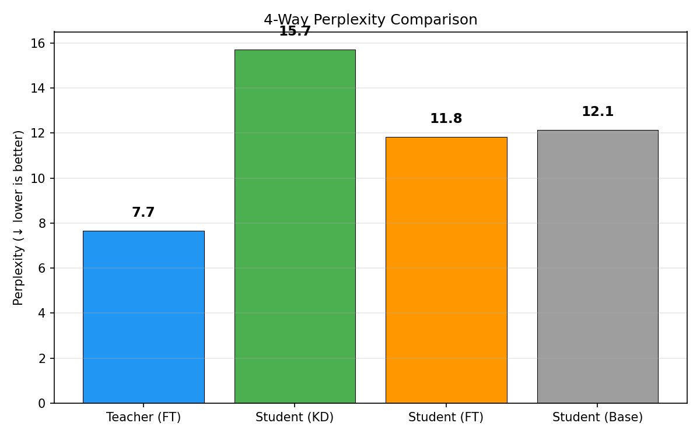
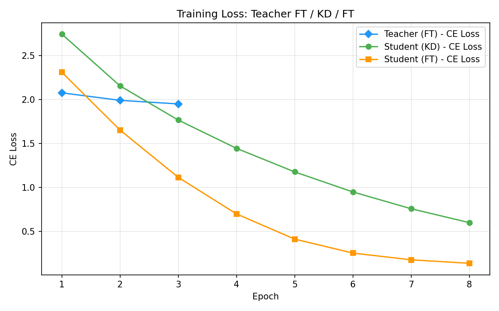
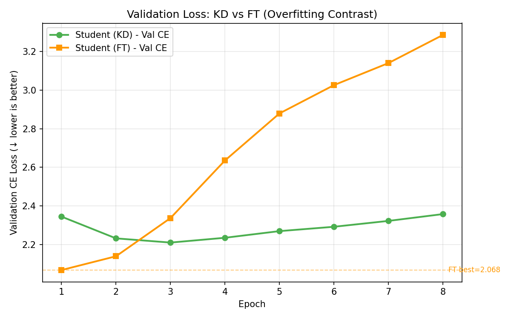
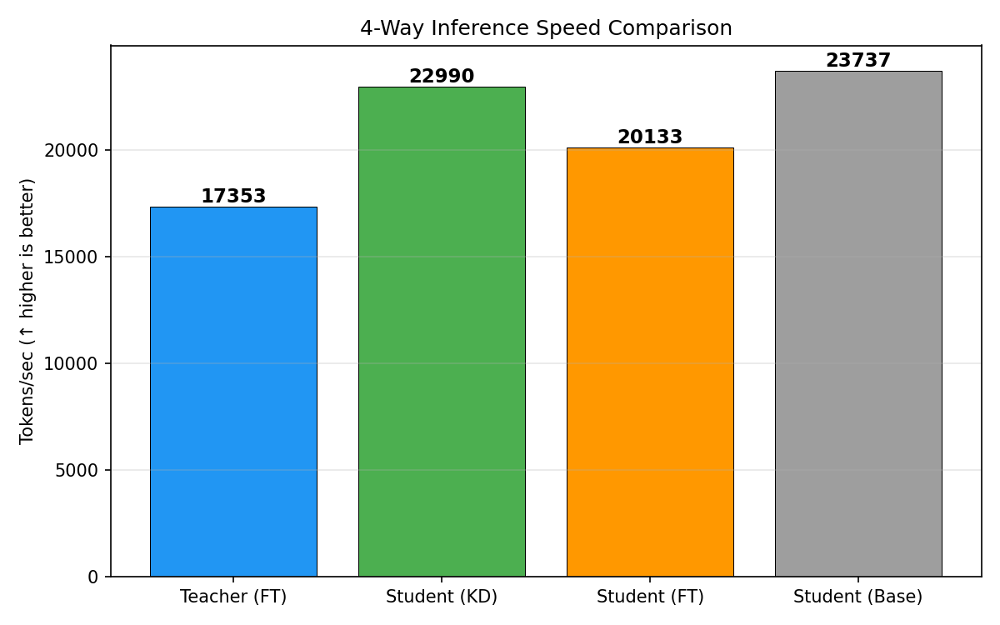

# 실험 노트 — Qwen 7B → 1.5B T4 Tokenmean KD v2

Run ID: `qwen7b-korean-t4-tokenmean-v2`

## 목적과 변경점

v1은 validation total loss 기준으로 epoch 8 checkpoint를 선택했지만, 최종 PPL과
직접 연결되는 validation CE는 epoch 3이 최저였다. v2는 학습 조건을 모두 유지하고
**best checkpoint 기준만 `val_total_loss`에서 `val_ce_loss`로 변경**했다.

| 항목 | 값 |
|---|---|
| Teacher / Student | Qwen2.5-7B / Qwen2.5-1.5B |
| 데이터 | 한국어 Wikipedia 1,000문서, seed 42 |
| sequence / batch | 256 / 2 |
| epochs / learning rate | 8 / 2e-5 |
| temperature / alpha | 4.0 / 0.2 |
| KD reduction | 유효 token 평균 (`tokenmean`) |
| Teacher | 기존 LoRA adapter 재사용 |
| FT baseline | 기존 best checkpoint 재사용 |
| 장치 / 정밀도 | H100 NVL / BF16 |

## 최종 결과

| 모델 | PPL | tokens/sec |
|---|---:|---:|
| Teacher (FT) | **7.66** | 17,353 |
| Student (KD) | 15.71 | 22,990 |
| Student (FT) | **11.81** | 20,133 |
| Student (Base) | 12.13 | 23,737 |

- v1 epoch 8 KD PPL `18.78` → v2 epoch 3 KD PPL `15.71`: **16.4% 개선**
- 기존 T2 batchmean KD PPL `14.35`보다는 1.36 높음
- FT보다 3.90, Base보다 3.58 높아 증류 효과는 여전히 확인되지 않음

## 시각화

## KD 학습 곡선

| Epoch | train CE | val CE | KD loss | 선택 |
|---:|---:|---:|---:|---|
| 1 | 2.746 | 2.345 | 1.582 | best |
| 2 | 2.156 | 2.232 | 1.217 | best |
| 3 | 1.767 | **2.211** | 1.142 | **최종 best** |
| 4 | 1.444 | 2.235 | 1.100 | |
| 5 | 1.176 | 2.270 | 1.070 | |
| 6 | 0.948 | 2.292 | 1.046 | |
| 7 | 0.757 | 2.323 | 1.025 | |
| 8 | 0.598 | 2.358 | 1.005 | |

Validation CE는 epoch 3 이후 상승한 반면 KD loss와 total loss는 계속 하락했다.
Teacher 분포를 더 잘 모방하는 것이 반드시 정답 token 예측 일반화로 이어지지는
않음을 보여준다. PPL 목적에서는 CE 기반 early stopping이 필수다.

## 수행 시간

KD 8 epoch 누적 시간은 약 **32분 55초**다. 영구 OS 디스크와 Spot watchdog을
사용해 VM 회수 후에도 checkpoint와 결과를 보존하고 완료 후 로컬로 자동 회수했다.

## 결론과 다음 실험

1. checkpoint 선택 오류 수정은 효과가 있었지만 KD가 FT/Base를 넘지는 못했다.
2. 다음 실험은 변수를 하나씩 분리해야 한다.
3. 우선 `T=2 + tokenmean`으로 reduction 효과만 비교한다.
4. 이후 `alpha=0.5`로 CE 비중을 높여 Teacher 모방과 정답 일반화의 균형을 본다.

